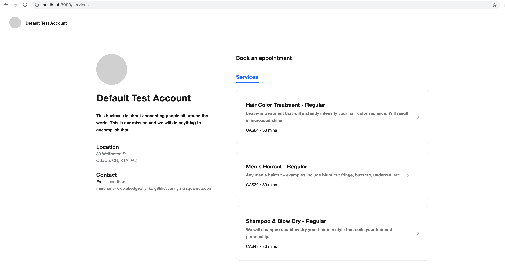
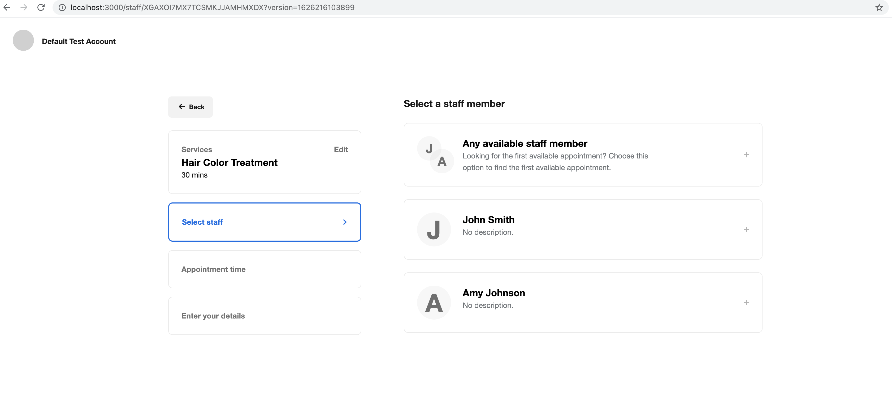
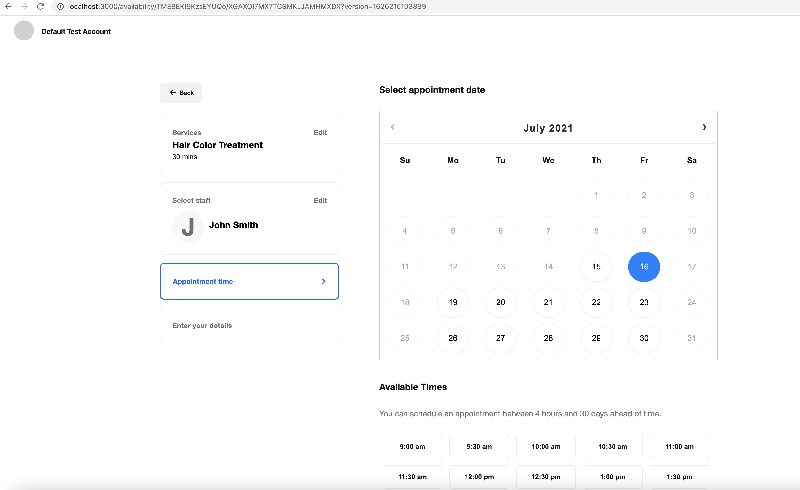
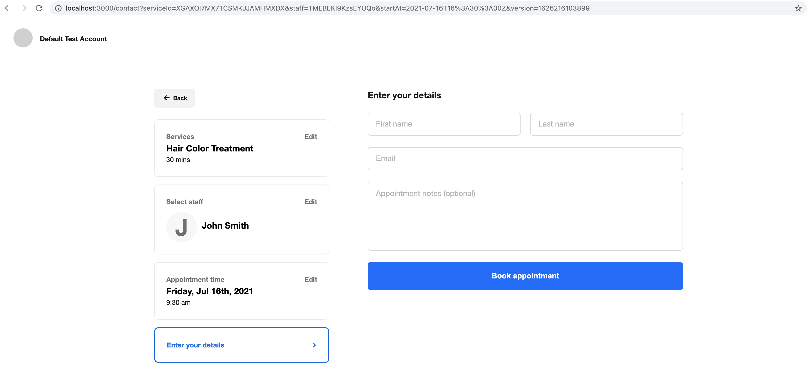
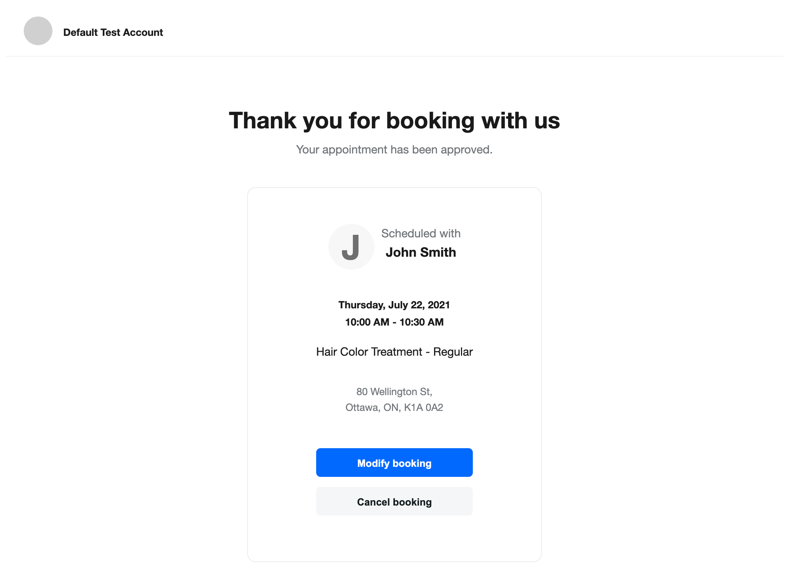

# Useful Links

* [Node.js SDK Page](https://developer.squareup.com/docs/sdks/nodejs)
* [Bookings API Overview](https://developer.squareup.com/docs/bookings-api/what-it-is)
* [Bookings API Reference](https://developer.squareup.com/reference/square/bookings-api)

# Booking API Sample App

- [Overview](#overview)
- [Setup](#setup)
- [Project organization](#project-organization)
- [Application flow](#application-flow)

# Overview

This sample web application integrates the Square [Bookings API](https://developer.squareup.com/reference/square/bookings-api) and showcases some of its functionality, including:

* Create booking
* Update booking
* Cancel booking
* Search availabilities
* List team member booking profiles
* Retrieve team member booking profile

In addition to using the Bookings API, the application demonstrates how to integrate the Boookings API with the following Square APIs:

* Calling the [Catalog API](https://developer.squareup.com/reference/square/catalog-api) to create and retrieve catalog objects of the appointment service type.
* Calling the [Customers API](https://developer.squareup.com/reference/square/customers-api) to create and retrieve customer profiles in the seller's customer directory.
* Calling the [Locations API](https://developer.squareup.com/reference/square/locations-api) to get information about the seller's business location used throughout the application.
* Calling the [Teams API](https://developer.squareup.com/reference/square/team-api) to retrieve the profile of a team member providing booked services in an appointment.

## Setup

### Set up the application

1. Ensure that you have npm installed (run `npm -v` in your terminal). If not, follow the instructions for your OS at [https://www.npmjs.com/get-npm](https://www.npmjs.com/get-npm).

2. Ensure that you have Node.js version v10 or later (run `node -v` in your terminal). If not, follow the instructions for your OS at [https://nodejs.org/en/download/](https://nodejs.org/en/download/).

3. Set your credentials:
    1. You need a *.env* file at the top directory to provide credentials. You can copy the content in the *.env.example* file provided in the project and use it as a template
    2. In the file:
        1. Set `ENVIRONMENT` to `sandbox` (for testing) or `production`
        2. Replace the placeholder texts of `SQUARE_ACCESS_TOKEN` and `SQUARE_LOCATION_ID` with your access token and your seller location ID, respectively, for the chosen environment.

    You can find your Square credentials in the Square Developer Dashboard. For more information, see [Getting Started](https://developer.squareup.com/docs/get-started#step-2-create-an-application).

    **IMPORTANT:** You can use your own credentials to test the sample application. If you plan to make a version of this sample application available for other users, you must use the Square [OAuth API](https://developer.squareup.com/docs/oauth-api/overview) to safely manage access to Square accounts.

4. Open a terminal and run the following command to install the sample application's dependencies:

   `npm install`

### Set up your seller account

To run this app, your seller account must have appointments enabled. The appointments service is free in the `sandbox` environment and incurs service charges in the `production` environment. We recommend using the `sandbox` environment for development and testing purposes.

To set up the apointments service in `sandbox`, follow these steps:

#### 1. Initialize test data

1. Ensure your `.env` file has `ENVIRONMENT` set to `sandbox` and provide sandbox environment values for `SQUARE_ACCESS_TOKEN` and `SQUARE_LOCATION_ID`

1. Run the seeding script provided in this sample app to create some services and staff members:
  
   `npm run seed`

   This command will create the following appointment services in your account:
   * Hair Color Treatment
   * Women's Haircut
   * Men's Haircut
   * Shampoo & Blow Dry

   And the following employees:
   * John Smith
   * Amy Johnson

**Note:** You can run `npm run clear` to delete these objects from the sandbox environment when they are no longer needed.  

#### 2. Enable Appointments for your business

1. Log into your [Developer Dashboard](https://developer.squareup.com/apps) in the browser.

1. Click the *Open* button beside your sandbox test account to open the Sandbox Seller Dashboard.

1. In the new tab, click on the *Appointments* tab on the left-hand side panel.

1. Click on the **Get Started** button on the center of the page.

1. Fill in your business information as prompted.

1. On the next page, skip the link to download the Square app for now.

1. If your business has more than one location, make sure to select the location provided in the *.env* file from the dropdown on the Dashboard's *Appointments* page.

You now have appointments enabled!

#### 3. Make your staff bookable

1. Click on the *Staff* tab on the left-hand side panel.

1. Click on the **Add Employee** button on the right side of the page.

1. Choose one of the two employees, `Amy Johnson` and `John Smith`, created by the seeding command, set optional configurations for the selected employee on the right-side panel, then click or tap the **Save** button on the right bottom corner of the page.

1. On the **Start Your Free Trial of Appointments for Teams** pop-up window, click or tap the **Start Trial** button. Note that use of the `sandbox` environment is always free of charge.

1. Repeat the **Add Employee** step to add the other staff.

1. Both `Amy Johnson` and `John Smith` should now be set up as service providers for the services created by the seeding command.

### Run the application

1. Run the following command in a terminal to start the server and test the application, in the environment specified in  the *.env* file.

   `npm start`

1. Type `localhost:3000` in your browser's address bar to start the application. Then select one from the list of services on the first page.

## Project organization

This application, as an Express.js project, is organized as follows:

* The *.env* file. The application provides the *.env.example* file in the project's main folder for you to copy as a template, to save it as *.env* in the same directory, and to provide your credentials in the saved *.env* file.
* The *public/* folder. Provides images, JavaScript, and CSS files used to render the pages.
* The *routes/* folder. Creates the following JavaScript files to define the routes to handle requests:
  * The *index.js* file. Redirects the index page via the `/services` route.
  * The *services.js* file. Defines a route to list appointmnet services.
  * The *staff.js* file. Defines a route to list bookable staff members for a booking.
  * The *availability.js* file. Defines routes to search availability based on selected services and staff members.
  * The *contact.js* file. Defines a route to display a customer contact information form before complete booking.
  * The *booking.js* file. Defines routes to get, create, reschedule, and cancel bookings.
* The *util/* folder. Includes the following:
  * The *square-client.js* file. Contains the utility code to initialize the Square SDK client.
  * The *date-helpers.js* file. Contains the utility code to create start dates and end dates for search of booking availability
* The *views/* folder. Provides the view (*.ejs*) files to render HTML displays.

## Application flow

The application flow is explained with the assumption that you are familiar with [Express](https://expressjs.com/) (the web framework for Node.js).

### Select services page



The landing page of the application is the *Select Services* page (i.e. _/services_), in which you can select one of the business services to book. Additionally, the left-hand pane will provide information about your business and location, based on your *.env* file configuration.

When you first open the browser to the app (i.e. http://localhost:3000), you will be redirected to the _/services_ route. The controller for this route will retrieve all services for the business location (based on your *.env* configuration), by calling the Search Catalog Items API with the **APPOINTMENTS_SERVICE** product type. See code in services.js:

```javascript
router.get("/", async (req, res, next) => {
  const cancel = req.query.cancel;
  try {
    let { result: { items } } = await catalogApi.searchCatalogItems({
      enabledLocationIds: [ locationId ],
      productTypes: [ "APPOINTMENTS_SERVICE" ]
    });

    if (!items) {
      items = [];
    }

    res.render("pages/select-service", { cancel, items });
  } catch (error) {
    console.error(error);
    next(error);
  }
});
```

### Select staff page



After selecting a service in the previous page, the application will redirect you to the *Select Staff* page (i.e. _/staff/:serviceId?version_). On this page, you can select a team member that provides the service you have selected in the previous step. Additionally, you can click on the **Any team member** button if you don't want to select a specific team member. That can be useful in cases where you want to schedule an appointment during the first available time slot across all team members. The controller for this route will retrieve all bookable team members that can preform the service you have perviously selected. Those are determined by cross referencing the following API calls:

*[Retrieve Catalog Object](https://developer.squareup.com/reference/square/catalog/retrieve-catalog-object)
*[List Team Member Booking Profiles](https://developer.squareup.com/reference/square/bookings/list-team-member-booking-profiles)
*[Search Team Members](https://developer.squareup.com/reference/square/team/search-team-members)

For more information, see code in staff.js:

```javascript
router.get("/:serviceId", async (req, res, next) => {
  const serviceId = req.params.serviceId;
  const serviceVersion = req.query.version;
  try {
    // Send request to get the service associated with the given item variation ID, and related objects.
    const retrieveServicePromise = catalogApi.retrieveCatalogObject(serviceId, true);

    // Send request to list staff booking profiles for the current location.
    const listBookingProfilesPromise = bookingsApi.listTeamMemberBookingProfiles(true, undefined, undefined, locationId);

    // Send request to list all active team members for this merchant at this location.
    const listActiveTeamMembersPromise = teamApi.searchTeamMembers({
      query: {
        filter: {
          locationIds: [ locationId ],
          status: "ACTIVE"
        }
      }
    });

    // Wait until all API calls have completed.
    const [ { result: services }, { result: { teamMemberBookingProfiles } }, { result: { teamMembers } } ] =
      await Promise.all([ retrieveServicePromise, listBookingProfilesPromise, listActiveTeamMembersPromise ]);

    // We want to filter teamMemberBookingProfiles by checking that the teamMemberId associated with the profile is in our serviceTeamMembers.
    // We also want to verify that each team member is ACTIVE.
    const serviceVariation = services.object;
    const serviceItem = services.relatedObjects.filter(relatedObject => relatedObject.type === "ITEM")[0];

    const serviceTeamMembers = serviceVariation.itemVariationData.teamMemberIds || [];
    const activeTeamMembers = teamMembers.map(teamMember => teamMember.id);

    const bookableStaff = teamMemberBookingProfiles
      .filter(profile => serviceTeamMembers.includes(profile.teamMemberId) && activeTeamMembers.includes(profile.teamMemberId));

    res.render("pages/select-staff", { bookableStaff, serviceItem, serviceVariation, serviceVersion });
  } catch (error) {
    console.error(error);
    next(error);
  }
});
```

### Select availability page



After selecting a service and a staff member to provide that service, you need to select a time for your booking/appointment. The application will redirect you to the *Select Availability* page in which you can select a time for your booking based on the available time slots for the service and the staff member combination you have selected. In this app, for simplicity, we allow booking an appointment 30 days to 4 hours in advance. By interacting with our calendar, you will be able to view the different available time slots for each day. The controller for this route (_/availability/:staffId/:serviceId?version_) will use the *dateHelper* utility (i.e. date-helper.js), as well as several API calls (mentioned in previous sections) to render the available times. Most importantly, it uses the [Search Availability API](https://developer.squareup.com/reference/square/bookings/search-availability) call to get available times for a specific service and team member combination.

For more information, see code in availability.js:

```javascript
router.get("/:staffId/:serviceId", async (req, res, next) => {
  const serviceId = req.params.serviceId;
  const serviceVersion = req.query.version;
  const staffId = req.params.staffId;
  const startAt = dateHelpers.getStartAtDate();
  const searchRequest = {
    query: {
      filter: {
        locationId,
        segmentFilters: [
          {
            serviceVariationId: serviceId,
          },
        ],
        startAtRange: {
          endAt: dateHelpers.getEndAtDate(startAt).toISOString(),
          startAt: startAt.toISOString(),
        },
      }
    }
  };
  try {
    // get service item - needed to display service details in left pane
    const retrieveServicePromise = catalogApi.retrieveCatalogObject(serviceId, true);
    let availabilities;
    // additional data to send to template
    let additionalInfo;
    // search availability for the specific staff member if staff id is passed as a param
    if (staffId === ANY_STAFF_PARAMS) {
      const [ services, teamMembers ] = await searchActiveTeamMembers(serviceId);
      searchRequest.query.filter.segmentFilters[0].teamMemberIdFilter = {
        any: teamMembers,
      };
      // get availability
      const { result } = await bookingsApi.searchAvailability(searchRequest);
      availabilities = result.availabilities;
      additionalInfo = {
        serviceItem: services.relatedObjects.filter(relatedObject => relatedObject.type === "ITEM")[0],
        serviceVariation: services.object
      };
    } else {
      searchRequest.query.filter.segmentFilters[0].teamMemberIdFilter = {
        any: [
          staffId
        ],
      };
      // get availability
      const availabilityPromise = bookingsApi.searchAvailability(searchRequest);
      // get team member booking profile - needed to display team member details in left pane
      const bookingProfilePromise = bookingsApi.retrieveTeamMemberBookingProfile(staffId);
      const [ { result }, { result: services }, { result: { teamMemberBookingProfile } } ] = await Promise.all([ availabilityPromise, retrieveServicePromise, bookingProfilePromise ]);
      availabilities = result.availabilities;
      additionalInfo = {
        bookingProfile: teamMemberBookingProfile,
        serviceItem: services.relatedObjects.filter(relatedObject => relatedObject.type === "ITEM")[0],
        serviceVariation: services.object
      };
    }
    // send the serviceId & serviceVersion since it's needed to book an appointment in the next step
    res.render("pages/availability", { availabilities, serviceId, serviceVersion, ...additionalInfo });
  } catch (error) {
    console.error(error);
    next(error);
  }
});
```

### Contact details page



After selecting service, staff member, and an available time slot for your appointment, the application will redirect you to the *Contact Details* page, in which you will provide your contact information. The information that you provide as part of this form will only be used to create a customer for you using the [Create Customer API](https://developer.squareup.com/reference/square/customers/create-customer), which is necessary in order to book an appointment. When testing, feel free to provide fake information. The controller for this route (i.e. _/booking/create_) will receive this POST request with the user information, and eventually call the [Create Booking API](https://developer.squareup.com/reference/square/bookings-api/create-booking) in order to create and schedule the appointment based on the service, team member, and availability provided in previous steps.

For more information, see code in booking.js:

```javascript
router.post("/create", async (req, res, next) => {
  const serviceId = req.query.serviceId;
  const serviceVariationVersion = req.query.version;
  const staffId = req.query.staffId;
  const startAt = req.query.startAt;

  const customerNote = req.body.customerNote;
  const emailAddress = req.body.emailAddress;
  const familyName = req.body.familyName;
  const givenName = req.body.givenName;

  try {
    // Retrieve catalog object by the variation ID
    const { result: { object: catalogItemVariation } } = await catalogApi.retrieveCatalogObject(serviceId);
    const durationMinutes = convertMsToMins(catalogItemVariation.itemVariationData.serviceDuration);

    // Create booking
    const { result: { booking } } = await bookingsApi.createBooking({
      booking: {
        appointmentSegments: [
          {
            durationMinutes,
            serviceVariationId: serviceId,
            serviceVariationVersion,
            teamMemberId: staffId,
          }
        ],
        customerId: await getCustomerID(givenName, familyName, emailAddress),
        customerNote,
        locationId,
        startAt,
      },
      idempotencyKey: uuidv4(),
    });

    res.redirect("/booking/" + booking.id);
  } catch (error) {
    console.error(error);
    next(error);
  }
});
```

### Confirmation page



If the booking was created successfully, you will be redirected to the *Confirmation* page. This page contains information about your scheduled appointment, such as the service name and description, the staff member, location information, date and time, etc. You will also see two different buttons to either *modify* or *cancel* your appointment. The controller for this route (i.e. _/booking/:bookingId_) will get the data to be rendered on this page by using several APIs mentioned in previous steps, but most importantly, the [Retrieve Booking API](https://developer.squareup.com/reference/square/bookings-api/retrieve-booking) which returns information about a specific booking, based on the booking ID.

For more information, see code in booking.js:

```javascript
router.get("/:bookingId", async (req, res, next) => {
  const bookingId = req.params.bookingId;
  try {
    // Retrieve the booking provided by the bookingId.
    const { result: { booking } } = await bookingsApi.retrieveBooking(bookingId);

    const serviceVariationId = booking.appointmentSegments[0].serviceVariationId;
    const teamMemberId = booking.appointmentSegments[0].teamMemberId;

    // Make API call to get service variation details
    const retrieveServiceVariationPromise = catalogApi.retrieveCatalogObject(serviceVariationId, true);

    // Make API call to get team member details
    const retrieveTeamMemberPromise = bookingsApi.retrieveTeamMemberBookingProfile(teamMemberId);

    // Wait until all API calls have completed
    const [ { result: service }, { result: { teamMemberBookingProfile } } ] =
      await Promise.all([ retrieveServiceVariationPromise, retrieveTeamMemberPromise ]);

    const serviceVariation = service.object;
    const serviceItem = service.relatedObjects.filter(relatedObject => relatedObject.type === "ITEM")[0];

    res.render("pages/confirmation", { booking, serviceItem, serviceVariation, teamMemberBookingProfile });
  } catch (error) {
    console.error(error);
    next(error);
  }
});
```

### Modify/reschedule booking page


By pressing on the **Modify booking** button in the confirmation page, you can modify the date/time of the appointment you have just created. You will be redirected to a screen similar to the *Select Availability* page, where you can re-select you desired time slot. This time however, clicking on a time slot will modify your previous booking right away, and there is no need to provide your contact information once again. The controller for this route (i.e. _/:bookingId/reschedule_) will use the [Search Availability API](https://developer.squareup.com/reference/square/bookings/search-availability) to find the available time slots for the booking. Once you pick a time slot, the controller for that route (i.e. POST _/booking/:bookingId/reschedule_) will run and use the [Update Booking API](https://developer.squareup.com/reference/square/bookings-api/update-booking) in order to modify your existing booking.

For more information, see code in booking.js:

```javascript
router.get("/:bookingId/reschedule", async (req, res, next) => {
  const bookingId = req.params.bookingId;
  try {
    // Retrieve the booking provided by the bookingId.
    const { result: { booking } } = await bookingsApi.retrieveBooking(bookingId);
    const { serviceVariationId, teamMemberId, serviceVariationVersion } = booking.appointmentSegments[0];
    const startAt = dateHelpers.getStartAtDate();
    const searchRequest = {
      query: {
        filter: {
          locationId,
          segmentFilters: [
            {
              serviceVariationId,
              teamMemberIdFilter: {
                any: [ teamMemberId ],
              }
            },
          ],
          startAtRange: {
            endAt: dateHelpers.getEndAtDate(startAt).toISOString(),
            startAt: startAt.toISOString(),
          },
        }
      }
    };
    // get availability
    const { result: { availabilities } } = await bookingsApi.searchAvailability(searchRequest);
    res.render("pages/reschedule", { availabilities, bookingId, serviceId: serviceVariationId, serviceVersion: serviceVariationVersion });
  } catch (error) {
    console.error(error);
    next(error);
  }
});
```

and

```javascript
/**
 * POST /booking/:bookingId/reschedule
 *
 * Update an existing booking, you may update the starting date
 */
router.post("/:bookingId/reschedule", async (req, res, next) => {
  const bookingId = req.params.bookingId;
  const startAt = req.query.startAt;

  try {
    const { result: { booking } } = await bookingsApi.retrieveBooking(bookingId);
    const updateBooking = {
      startAt,
      version: booking.version,
    };

    const { result: { booking: newBooking } } = await bookingsApi.updateBooking(bookingId, { booking: updateBooking });

    res.redirect("/booking/" + newBooking.id);
  } catch (error) {
    console.error(error);
    next(error);
  }
});
```

### Cancel booking action


By pressing on the **Cancel booking** button in the confirmation page, the controller for this route (i.e. _POST /booking/:bookingId/delete_) will run and cancel your booking. It will use the [Cancel Booking API](https://developer.squareup.com/reference/square/bookings-api/cancel-booking) to do so. You will then be redirected to the initial landing page (i.e. _/services_), with an appropriate toast. This can be seen in the screenshot above.

For more information, see code in booking.js:

```javascript
/**
 * POST /booking/:bookingId/delete
 *
 * delete a booking by booking ID
 */
router.post("/:bookingId/delete", async (req, res, next) => {
  const bookingId = req.params.bookingId;

  try {
    const { result: { booking } } = await bookingsApi.retrieveBooking(bookingId);
    await bookingsApi.cancelBooking(bookingId, { bookingVersion: booking.version });

    res.redirect("/services?cancel=success");
  } catch (error) {
    console.error(error);
    next(error);
  }
});
```