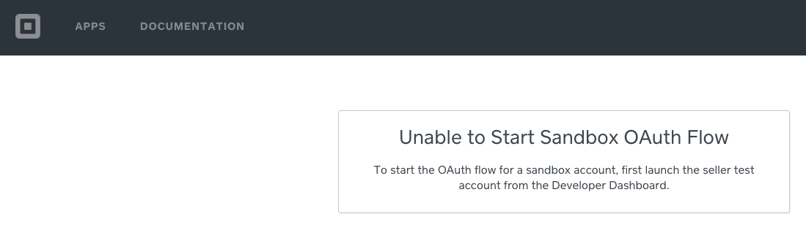

# Connect OAuth Flow Example (PHP)

This example demonstrates a bare-bones PHP implementation of the OAuth flow for
Square APIs. It serves a link that directs merchants to the OAuth Permissions form
and handles the result of the authorization, which is sent to your application's
Redirect URL (specified on the application dashboard).

For more information, see [OAuth Overview](https://docs.connect.squareup.com/api/oauth#oauth-overview),
along with the comments included in `callback.php`.

## Setup

### Download Composer and Unirest

This application requires the Unirest HTTP library for PHP, which you install via
Composer.

First, download Composer in this directory with the instructions on
[this page](https://getcomposer.org/download/).

After you've downloaded Composer, install the Unirest dependency with the following
command from this directory:

    php composer.phar install

### Square Sandbox testing
If you want to run this sample against the Square Sandbox environment:

1. Set your application dashboard to **Sandbox Settings** mode before completing
the following steps.
1. Add a new **Sandbox Test Account**:

   a. Click **New Account** on the dashboard home page.<br>
   b. Give the account a name and pick a country. <br>
   c. Uncheck **Automatically create authorizations for all my current apps**.<br>

1. Click **Launch** on the new test account to open the sandbox seller dashboard
for the account. The OAuth flow will create an authorization for this account.

### Specify your application credentials

In order for the sample to work, you must specify fields in `callback.php` and `index.php`:

* In both files, replace the value of `$application_id` with your application's ID,
available on your [application dashboard](https://connect.squareup.com/apps).

* In `callback.php`, replace the value of `$applicationSecret` with your
application's secret, also available on your application dashboard.

### Set your application's Redirect URL

On your application dashboard, set your application's Redirect URL to `http://localhost:8000/callback.php`.

Note that applications that don't use a `localhost` URL must use HTTPS. HTTP is
allowed for `localhost` URLs to simplify the development process.

## Running the example

To run the example, execute the following from the directory that contains these files:

    php -S localhost:8000

You can then proceed through the OAuth flow by visiting `http://localhost:8000`
in your web browser.

### App is authorized
If you have configures the app with your application ID, secret, and redirect URL correctly, you will see the following output to the php terminal/
```
    [Fri Dec  6 15:42:08 2019] ::1:51778 [200]: /callback.php?code=sandbox-...AUaQ&response_type=code
```

### When things go wrong
You can get a `401` for a few reasons, including:
* You are using credentials from one environment but the base URL of the Connect v2 SDK client is still set to the other.  For example, you are using production credentials and the client base URL is set to the sandbox environment.
* You have not set your credentials in the callback.php file and index.php file.
```
    [Fri Dec  6 15:40:23 2019] [HTTP/1.1 401 Unauthorized] {
    "message": "Not Authorized",
    "type": "service.not_authorized"
    }
```

Attempting to authorize the app may open a web page like the following page.  This happens when you have not launched a sandbox test account seller dashboard in your browser before you started the OAuth flow.


