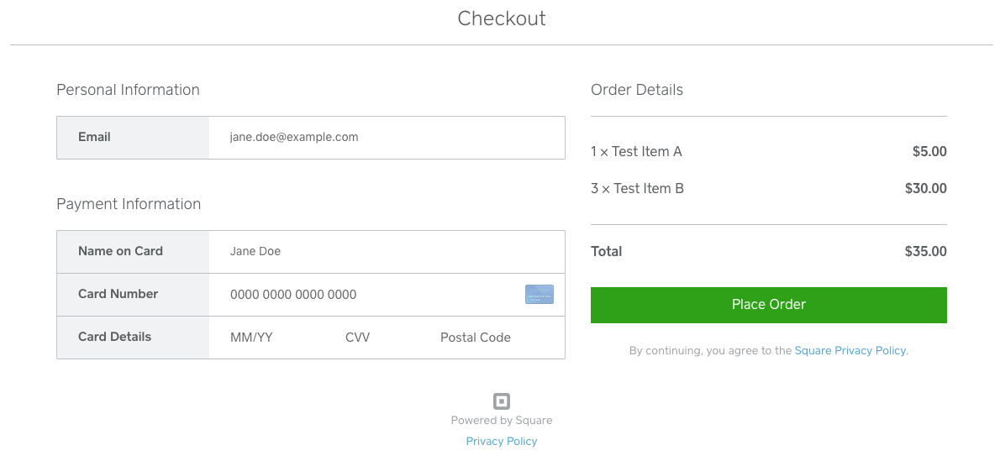

# Website Payment Processing Using the Square Checkout API: Csharp

This is a simple example application that utilizes Square's Checkout API 
using ASP.NET Core Razor. This examples assumes you are familiar with C# development. 

For more information about the Checkout API, see:
* [What It Does](https://developer.squareup.com/docs/checkout-api/what-it-does)
* [CreateCheckout - API Reference](https://developer.squareup.com/docs/api/connect/v2#endpoint-checkout-createcheckout)
* [CreateCheckout - Connect C# SDK](https://github.com/square/connect-csharp-sdk/blob/master/docs/CheckoutApi.md) 

There are two sections in this ReadMe.
* [Setup](#setup) - Provides instructions for you to download and run the app.
* [Application Flow](#application-flow) - Provides an overview of how the Square 
Checkout API integrate in the ASP.NET app.

## Setup
To get it running:

* Clone/download to your local computer.
* Place your production credentials in `appsettings.Production.json`
  * <b>WARNING</b>: never upload .env with your credential/access_token
* Place your sandbox credentials in `appsettings.Sandbox.json`
  * <b>WARNING</b>: never upload .env with your credential/access_token
* Run the following command in your terminal, while inside the "csharp_checkout" (this) directory to start your server:
```
dotnet run --launch-profile Sandbox
```
  * Note: replace "Sandbox" with "Production" to use your production credentials.

This will start the server on `localhost:5000`, which you can navigate to in your favorite browser.


## Application flow

This is an ASP.NET Core Razor application. The web application implements the 
Checkout API to take payments.   

The application works as follows:

1. Buyer places an order using the application frontend. 

   In this application we hardcode an order with couple of line items 
   and show a **Pay now!** button. See index.cshtml. 

2. Buyer clicks **Pay now!** when ready to checkout. This submits
the  **Checkout** event to the handler ( **CheckoutMode.OnPost** in 
Checkout.cshtml.cs). The event handler does the following:

    1. Send a `CreateCheckout` request to Square as follows:
        * Create a `CheckoutApi` client.
        * Create an instance of `CreateOrderRequest` with information about the order 
        the buyer placed.
        * Create an instance of `CreateCheckoutRequest` with the `CreateOrderRequest` 
        instance.
        * Call the `CreateCheckout` method with`CreateCheckoutRequest` object and the  `locationId` parameters.
          ```csharp
          CreateCheckoutResponse response = checkoutApi.CreateCheckout(locationId, createCheckoutRequest);
          ```

    1. Square does necessary configuration to create a prebuilt checkout page and
    returns a `Checkout` object with a URL (`CheckoutPageUrl`) to the checkout page and the `Order` to be checked out.

    1. The application responds by redirecting the buyer's browser to the `CheckoutPageUrl`. 
        ```csharp
        return Redirect(response.Checkout.CheckoutPageUrl);
        ```
      
        The buyer sees following page hosted on Square.

        

        This page hosted on Square shows all the order information  and also the 
        **Payment Information** section.
       
    1. Buyer provides card information and clicks **Place Order**. 

    1. Square processes the payment and redirects the buyer to a confirmation  page. If you provided **redirect_url** in your initial `CreateCheckoutRequest`, Square returns the buyer to that page. Otherwise, Square redirects the buyer to Square provided confirmation page. An example screenshot is shown:

        


