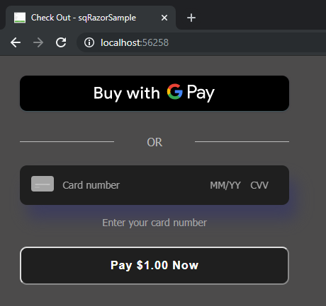

# Payment processing example: Csharp

This sample demonstrates processing card payments with Square Connect API, using the
Square Connect C# client library and dotnet core. There are two sections in this ReadMe.
* [Setup](#setup) - Provides instructions for you to download and run the app.
* [Application Flow](#application-flow) - Provides an overview of how the Square Payment form integrates in the ASP.NET app.

## Setup

### Requirements

* Download and install [.net core 2.0](https://www.microsoft.com/net/download/macos)
* Signup a Square account from [Square website](https://squareup.com/signup)
* You have learned the basics from [Square Developer Docs](https://docs.connect.squareup.com/)

### Setup your square account

1. Login to [Square Dashboard](https://squareup.com/dashboard/)
2. Create some items from [Items Tab](https://squareup.com/dashboard/items/library)
3. Go to [Square Developer Portal](https://connect.squareup.com/apps) and create a new application.

### Build the project

After cloning this sample project to local, open command line tool, and from the project root directory run:

    dotnet build

### Provide required credentials

Open `./appsettings.json` and replace "AccessToken", "LocationId" and "ApplicationId" with the ids you get from your square application created in [Square Developer Portal](https://connect.squareup.com/apps).
<b>WARNING</b>: never upload `appsettings.json` with your credentials/access_token.

If you're just testing things out, it's recommended that you use your _sandbox_
credentials for now. See
[this article](https://docs.connect.squareup.com/articles/using-sandbox/)
for more information on the API sandbox.

## Running the sample

Run the command from the project root directory:

    dotnet run

Then you can visit:

    http://localhost:5000

* You'll see a simple payment form that will charge $1.00.
* You can test a valid credit card transaction by providing the following card information in the form:

    * Card Number 4532 7597 3454 5858
    * Card CVV 111
    * Card Expiration (Any time in the future)
    * Card Postal Code (Any valid US postal code)

You can find more testing values in this [article](https://docs.connect.squareup.com/articles/using-sandbox)

**Note that if you are _not_ using your sandbox credentials and you enter _real_
credit card information, YOU WILL CHARGE THE CARD.**

## Application Flow

testThis is an ASP.NET Core Razor application. The web application implements the Square Online payment solution to charge a payment source (debit, credit, or digital wallet payment cards).

Square Online payment solution is a 2-step process: 

1. Generate a nonce -  Using a Square Payment Form (client-side JavaScript library **SqPaymentForm**) you accept payment source information and generate a secure payment token (nonce).

    NOTE: The SqPaymentForm library renders the card inputs and digital wallet buttons that make up the payment form and returns a secure payment token (nonce). For more information, see https://docs.connect.squareup.com/payments/sqpaymentform/what-it-does .

    

2. Charge the payment source using the nonce - Using a server-side component, that uses the Connect V2 Transaction API, you charge the payment source using the nonce.

### Step 1: Generate a Nonce

When the page loads it renders the form defined in the **index.cshtml** view file. The page also downloads and executes the following scripts defined in the view file:

**Square Payment Form Javascript library** (https://js.squareup.com/v2/paymentform) - The library provides the SqPaymentForm object you create in the next script. For more information about the library, see [SqPaymentForm data model](https://docs.connect.squareup.com/api/paymentform#navsection-paymentform). 

**sq-payment-form.js** - This code provides two things:

* Initializes the **SqPaymentForm** object by initializing various 
[configuration fields](https://docs.connect.squareup.com/api/paymentform#paymentform-configurationfields) and providing implementation for [callback functions](https://docs.connect.squareup.com/api/paymentform#_callbackfunctions_detail). For example,

    * Maps the **SqPaymentForm.cardNumber** configuration field to corresponding form field:  

        ```javascript
        cardNumber: {
            elementId: 'sq-card-number',               
            placeholder: '•••• •••• •••• ••••'
        },
        ```
    * **SqPaymentForm.cardNonceResponseReceived** is one of the callbacks the code provides implementation for. 

* Provides the **onGetCardNonce** event handler code that executes after you choose click **Pay $1.00 Now**.

After you fill the form and choose Pay $1 Now, the application does the following: 

* The **onGetCardNonce** event handler executes. It first generates a nonce by calling the **SqPaymentForm.requestCardNonce** async function.
* **SqPaymentForm.requestCardNonce** invokes **SqPaymentForm.cardNonceResponseReceived** callback. This callback  assigns the nonce to a form field and posts the form to the payment processing page:

    ```
    document.getElementById('card-nonce').value = nonce;
    document.getElementById('nonce-form').submit();  
    ```

    This invokes the form action **ProcessPayment**, described in next step.

### Step 2: Charge the Payment Source Using the Nonce 
All the remaining actions take place in the **ProcessPayment.cshtml.cs**.  This server-side component uses the Square .NET SDK C# wrapper library to call the Connect V2 Transaction API to charge the payment source using the nonce.


