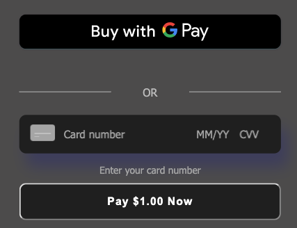

# Java Payment Form Example

This example hosts a payment form in Java. It is a Spring Boot app and requires Java 8 or newer. There are two sections in this ReadMe.

* [Setup](#setup) - Provides instructions for you to download and run the app.
* [Application Flow](#application-flow) - Provides an overview of how the Square Payment form integrates in the Java example.

## Setup

First, you'll need to have created a Square application. If you haven't done this yet, you can quickly
set on up in the [Square Developer Portal](https://connect.squareup.com/apps).

Once you've created an Square application, you'll need both the Application ID and the
Personal Access Token for it. These are available in the Square Developer Portal as well.

If you want to test Apple Pay, you'll need to replace the contents of
`src/main/resources/public/.well-known/apple-developer-merchantid-domain-association`.
You can get real content for this file from the
[Square Developer Portal](https://connect.squareup.com/apps), in the Apple Pay section of your
application.

Note that Apple Pay cannot be tested when running locally. You'll need to deploy the app to try it out.


## Running locally

The app can be run on a command line using Maven. The application expects three environment variables
to be set: `SQUARE_APP_ID`, `SQUARE_LOCATION_ID` and `SQUARE_ACCESS_TOKEN`. Both of these can be copied from the
[Developer Dashboard](https://connect.squareup.com/apps). Keep in mind that the access token is
sensitive and must remain private.

To get up and running, first clone the repo to your local computer.
Then open a command line terminal and run the following command:

```bash
# The following command sets environment variables and starts the application locally:
SQUARE_ENV=<sandbox or production> SQUARE_APP_ID=replace_me SQUARE_ACCESS_TOKEN=replace_me SQUARE_LOCATION_ID=replace_me mvn spring-boot:run
```

After running the above command, you can open a browser and go to
[http://localhost:5000](http://localhost:5000).

The default port used is `5000`, but this can be configured in the `application.properties` file.

If the credentials are not set or are invalid, the app will fail during startup.

If you need to stop the server process, type `lsof -i :5000` on the command line and then find the PID of the java command. Type `kill -9 SOME_PID` to stop the process.

## Application Flow

The Java web application implements the Square Online payment solution to charge a payment source (debit, credit, or digital wallet payment cards).

Square Online payment solution is a 2-step process:

1. Generate a nonce -  Using a Square Payment Form (a client-side JavaScript library
called the **SqPaymentForm**) you accept payment source information and generate a secure payment token (nonce).

    NOTE: The SqPaymentForm library renders the card inputs and digital wallet buttons that make up the payment form and returns a secure payment token (nonce). For more information, see [Square Payment Form - What It Does](https://developer.squareup.com/docs/payment-form/what-it-does) .

    After embedding the Square Payment form in your web application, it will look similar to the following screenshot:

    

2. Charge the payment source using the nonce - Using a server-side component, that uses the Connect V2
**Payments** API, you charge the payment source using the nonce.
s
The following sections describe how the Java sample implements these steps.

### Step 1: Generate a Nonce

When the page loads it renders the form defined in the index.html file. The page also downloads and executes the following scripts defined in the file:

 **Square Payment Form Javascript library** (https://js.squareup.com/v2/paymentform)  It is a library that provides the SqPaymentForm object you use in the next script. For more information about the library, see [SqPaymentForm data model](https://docs.connect.squareup.com/api/paymentform#navsection-paymentform).

**sq-payment-form.js** - This code provides provides the following:

* Initializes a **SqPaymentForm** object (`paymentFormWallets`) for the digital wallets by initializing various
[configuration fields](https://docs.connect.squareup.com/api/paymentform#paymentform-configurationfields) and providing implementation for [callback functions](https://docs.connect.squareup.com/api/paymentform#_callbackfunctions_detail).
* Initializes a **SqPaymentForm**  (beta) object (`paymentForm`) for the single-element payment form by initializing various
[configuration fields](https://docs.connect.squareup.com/api/paymentform#paymentform-configurationfields) and providing implementation for [callback functions](https://docs.connect.squareup.com/api/paymentform#_callbackfunctions_detail). For example,

    * Maps the **SqPaymentForm.card** configuration field to corresponding form field:

        ```javascript
        card: {
          elementId: 'sq-card',
          inputStyle: {
            fontSize: '14px',
            fontWeight: 500,
            fontFamily: 'tahoma',
            placeholderFontWeight: 300,
            borderRadius: '10px',
            autoFillColor: '#FFFFFF',     //Card number & exp. date strings
            color: '#FFFFFF',             //CVV & Zip
            placeholderColor: '#A5A5A5',  //card field hints
            backgroundColor: '#1F1F1F',   //Card entry background color
            cardIconColor: '#A5A5A5',    //Card Icon color
            boxShadow: "10px 20px 20px #3d3d5c",
            ...
          }
        }
        ```
    * **SqPaymentForm.cardNonceResponseReceived** is one of the callbacks the code provides implementation for.

* Provides the **onGetCardNonce** event handler code that executes after you click **Pay $1.00 Now**.

After the buyer enters their information in the form and clicks **Pay $1 Now**, the application does the following:

* The **onGetCardNonce** event handler executes. It first generates a nonce by calling the **SqPaymentForm.requestCardNonce** function.
* **SqPaymentForm.requestCardNonce** invokes **SqPaymentForm.cardNonceResponseReceived** callback. This callback  assigns the nonce to a form field and posts the form to the payment processing page:

    ```javascript
    document.getElementById('card-nonce').value = nonce;
    document.getElementById('nonce-form').submit();
    ```

    This invokes the form action **charge**, described in next step.

### Step 2: Charge the Payment Source Using the Nonce
All the remaining actions take place in the **Main.java**.  This server-side component uses the Square Java SDK library to call the Connect V2 **Payments** API to charge the payment source using the nonce as shown in the following code fragment.
```java
String charge(@ModelAttribute NonceForm form, Map<String, Object> model) throws ApiException {
    CreatePaymentRequest createPaymentRequest = new CreatePaymentRequest()
        .idempotencyKey(UUID.randomUUID().toString())
        .amountMoney(new Money().amount(1_00L).currency("USD"))
        .sourceId(form.getNonce())
        .note("From a Square sample Java app");

    PaymentsApi paymentsApi = new PaymentsApi(squareClient);

    CreatePaymentResponse response = paymentsApi.createPayment(createPaymentRequest);

    model.put("payment", response.getPayment());

    return "charge";
}
```
