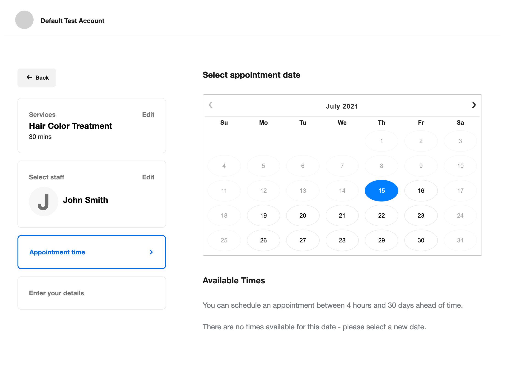
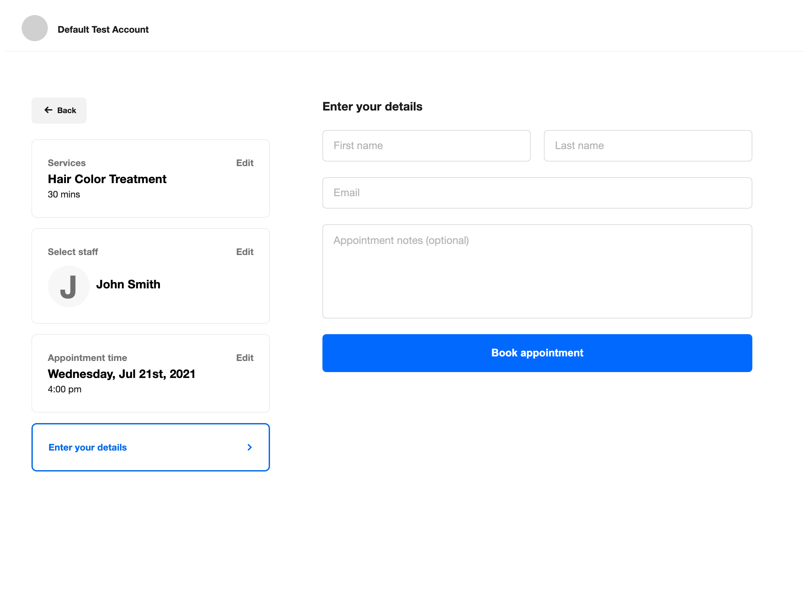
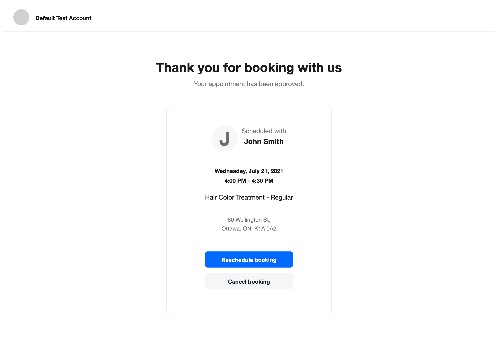
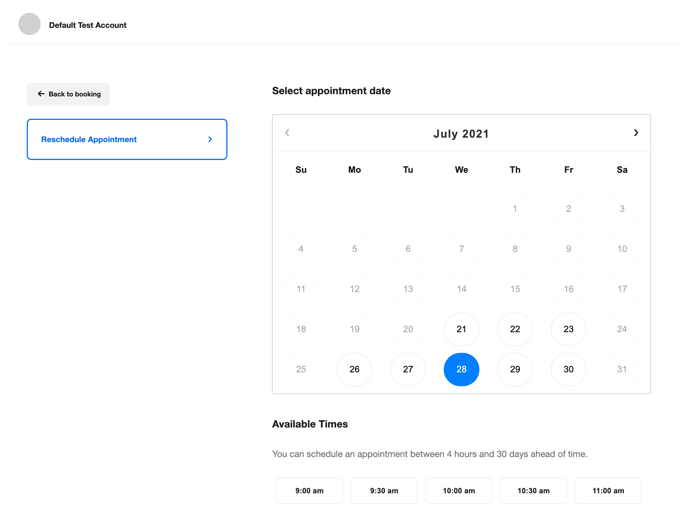

# Useful Links

* [Node.js SDK Page](https://developer.squareup.com/docs/sdks/nodejs)
* [Bookings API Overview](https://developer.squareup.com/docs/bookings-api/what-it-is)
* [Bookings API Reference](https://developer.squareup.com/reference/square/bookings-api)

# Bookings API Sample App

* [Overview](#overview)
* [Setup](#setup)
* [Project organization](#project-organization)
* [Application flow](#application-flow)

# Overview

This sample web application integrates the Square [Bookings API](https://developer.squareup.com/reference/square/bookings-api) and showcases some of its functionality, including:

* Creating bookings.
* Updating bookings.
* Canceling bookings.
* Searching availabilities.
* Listing team member booking profiles.
* Retrieving a team member booking profile.

In addition to using the Bookings API, the application demonstrates how to integrate the Bookings API with the following Square APIs:

* Calling the [Catalog API](https://developer.squareup.com/reference/square/catalog-api) to create and retrieve catalog objects of the appointments service type.
* Calling the [Customers API](https://developer.squareup.com/reference/square/customers-api) to create and retrieve customer profiles in the seller's Customer Directory.
* Calling the [Locations API](https://developer.squareup.com/reference/square/locations-api) to get information about the seller's business location used throughout the application.
* Calling the [Team API](https://developer.squareup.com/reference/square/team-api) to retrieve the profile of a team member providing booked services in an appointment.

## Setup

### Set up the application

1. Ensure that you have npm installed (run `npm -v` in your terminal). If not, follow the instructions for your OS at [https://www.npmjs.com/get-npm](https://www.npmjs.com/get-npm).

2. Ensure that you have Node.js version v10 or later (run `node -v` in your terminal). If not, follow the instructions for your OS at [https://nodejs.org/en/download/](https://nodejs.org/en/download/).

3. Set your credentials:
    a. You need an *.env* file at the top directory to provide credentials. You can copy the content in the *.env.example* file provided in the project and use it as a template.
    b. In the file:
        * Set `ENVIRONMENT` to `sandbox` (for testing) or `production`.
        * Replace the placeholder texts of `SQUARE_ACCESS_TOKEN` and `SQUARE_LOCATION_ID` with your access token and your seller location ID, respectively, for the chosen environment.

    You can find your Square credentials in the Square Developer Dashboard. For more information, see [Getting Started](https://developer.squareup.com/docs/get-started#step-2-create-an-application).

    **IMPORTANT:** You can use your own credentials to test the sample application. If you plan to make a version of this sample application available to other users, you must use the Square [OAuth API](https://developer.squareup.com/docs/oauth-api/overview) to safely manage access to Square accounts.

4. Open a terminal and run the following command to install the sample application's dependencies:

   `npm install`

### Set up your seller account

To run this application, your seller account must have appointments enabled. The appointments service is free in the Sandbox environment and may incur service charges in the Production environment. You should use the Sandbox environment for development and testing purposes.

To set up the appointments service in the Sandbox, follow these steps:

#### 1. Initialize test data

a. Ensure that your *.env* file has `ENVIRONMENT` set to `sandbox` and provides the Sandbox environment values for `SQUARE_ACCESS_TOKEN` and `SQUARE_LOCATION_ID`.

b. Run the seeding script provided in this sample application to create some services and staff members:
  
   `npm run seed`

   This command creates the following appointments services in your account:

   * Hair Color Treatment
   * Women's Haircut
   * Men's Haircut
   * Shampoo & Blow Dry

   And the following employees:
   * John Smith
   * Amy Johnson

**Note:** You can run `npm run clear` to delete these objects from the Sandbox environment when they are no longer needed.  

#### 2. Enable Appointments for your business

a. Sign in to the [Developer Dashboard](https://developer.squareup.com/apps) in the browser.

b. Choose the **Open** button beside your Sandbox test account to open the Sandbox Seller Dashboard.

c. Choose the **Appointments** tab on the left pane.

d. Choose **Get Started**.

e. Enter your business information as prompted.

f. On the next page, skip the link to download the Square application for now.

g. If your business has more than one location, make sure to select the location provided in the .env file from the drop-down menu on the **Appointments** page.

You now have Appointments enabled.

#### 3. Make your staff bookable

a. Choose the **Staff** tab on the left pane.

b. Choose the **Add Employee** button on the right side of the page.

c. Choose one of the two employees (Amy Johnson or John Smith) created by the seeding command, set optional configurations for the selected employee on the right-side pane, and then choose the **Save** button on the right bottom corner of the page.

d. On the **Start Your Free Trial of Appointments for Teams** window, choose the **Start Trial** button. Note that use of the Sandbox environment is always free of charge.

e. Repeat the **Add Employee** step to add the other staff member.

f. Both Amy Johnson and John Smith should now be set up as service providers for the services created by the seeding command.

### Run the application

1. Run the following command in a terminal to start the server and test the application, in the environment specified in the .env file.

   `npm start`

2. Type `localhost:3000` in your browser to start the application. Then select a service on the first page.

## Project organization

This application, as an Express.js project, is organized as follows:

* The *.env* file. The application provides the *.env.example* file in the project's main folder for you to copy as a template, save it as *.env* in the same directory, and provide your credentials in the saved *.env* file.
* The *public/* folder. Provides images, JavaScript, and CSS files used to render the pages.
* The *routes/* folder. Creates the following JavaScript files to define the routes to handle requests:
  * The *index.js* file. Redirects the index page using the `/services` route.
  * The *services.js* file. Defines a route to list appointment services.
  * The *staff.js* file. Defines a route to list bookable staff members for a booking.
  * The *availability.js* file. Defines routes to search availability based on selected services and staff members.
  * The *contact.js* file. Defines a route to display a customer contact information form before completing a booking.
  * The *booking.js* file. Defines routes to get, create, reschedule, and cancel bookings.
* The *util/* folder. Includes the following:
  * The *square-client.js* file. Contains the utility code to initialize the Square SDK client.
  * The *date-helpers.js* file. Contains the utility code to create start dates and end dates for the search of booking availability.
* The *views/* folder. Provides the view (*.ejs*) files to render HTML displays.

## Application flow

This sample application is a Node.js-[Express](https://expressjs.com/) project.

In general, Express is a web application framework for Node.js. It supports provisioning a user interface for the application to interact with the user by  rendering HTML pages. A user action corresponds to an HTTP or HTTPS request passed to the backend through a specific route and is handled by the corresponding route handler in Node.js.  

Specifically, when the sample application is running, it can perform the following interactive tasks:  

* [**Select bookable services**](#select-bookable-services)
* [**Select a bookable staff**](#select-a-bookable-staff)
* [**Select booking availability**](#select-booking-availability)
* [**Provide customer contact information**](#provide-customer-contact-information)
* [**Create a booking**](#create-a-booking)
* [**Get the booking confirmation**](#get-the-booking-confirmation)
* [**Reschedule a booked appointment**](#reschedule-a-booked-appointment)
* [**Cancel a booked appointment**](#cancel-a-booked-appointment)

Each user interaction is implemented in a pair of Express view page (_/views/pages/<*>.ejs_) and route handler file (_/routes/<*>.js_). The view presents the frontend to accept a user input and the route handler serves in the backend to process the user input and, depending on the result, to direct the application to another view page to gather more information from the user or to another route for further processing. A view can branch into multiple routes and, similarly, a route can circle back into multiple views.

With the application's backend running, the user opens the application's home page (such as `http://localhost:3000` for the locally hosted application) to start the application flow. This starting request is handled by the [/ route handler](routes/index.js#L33) defined in the _/routes/index.js_ file. It simply redirects the request to the `/services` route handler that lets the user select a bookable service.

### Select bookable services

The [_/services_ route handler](routes/services.js#L29) calls the [`SearchCatalogItems`](https://developer.squareup.com/reference/square/catalog/search-catalog-items) endpoint of the Catalog API to retrieve all of the appointments services, as represented by [`CatalogItem`](https://developer.squareup.com/reference/square/objects/CatalogItem) objects with the [`product_type`](https://developer.squareup.com/reference/square/objects/CatalogItem#definition__property-product_type) attribute value set to [`APPOINTMENTS_SERVICE`](https://developer.squareup.com/reference/square/enums/CatalogItemProductType#value-APPOINTMENTS_SERVICE). Notice that the route path of `/` in the route handler code is relative to the `/services` route.

It then opens the [_/views/pages/select-service.ejs_](views/pages/select-service.ejs) page that presents a list of bookable services for the user to select one.

The left-hand pane provides information about the business providing the service, including the location and contact information.

The selection of a particular service is then followed by a request to select a servicing staff for the selected service by way of the `/staff/:serviceId` route.

### Select a bookable staff

The `/staff/:serviceId` route is handled by the route handler defined in [_/routes/staff.js_](routes/staff.js). This route handler retrieves all active and bookable team members that can perform the service and presents the staff members for the user to choose. To do so, the route handler carries out the following tasks:

* Calls the [RetrieveCatalogObject](https://developer.squareup.com/reference/square/catalog/retrieve-catalog-object) endpoint of the Catalog API to retrieve the `CatalogObject` of the specified service ID.
* Calls the [SearchTeamMembers](https://developer.squareup.com/reference/square/team/search-team-members) endpoint of the Team API to find all active team members capable of providing the chosen service.
* Calls the [ListTeamMemberBookingProfiles](https://developer.squareup.com/reference/square/bookings/list-team-member-booking-profiles) endpoint of the Bookings API to verify that the team members are bookable.
* Renders the [select-stff.ejs](views/pages/select-staff.ejs) page for the user to select a servicing staff member.

In addition to specific staff members, there is the **Any available staff member** option for the user to accept any staff member for the booking.

The selection of a staff member is then followed by a request to select booking availability from a list of available time periods for the service and team member requested. This request proceeds by way of the [_availability/:staffId/:serviceId?version_](routes/availability.js) route.

### Select booking availability

The `availability/:staffId/:serviceId` route is handled by the route handler defined in [_routes/availability.js_](routes/availability.js). This route handler calls the [searchAvailability](https://developer.squareup.com/reference/square/bookings/search-availability) of the Bookings API to get the available appointment segments for the specified service and staff. It then renders the [_availability.ejs_](views/pages/availability.ejs) page for the user to pick an available date and time for the appointment.

On this page, the user interfaces of **Select appointment date** and **Available times** are rendered according to [date-selector.ejs](views/partials/date-selector.ejs). The related user-event handler is defined in [_date-picker-handler.js_](public/js/date-picker-handler.js)

After the user chooses an appointment date and available time periods, the application submits a request to collect customer contact information from the user to complete the booking. The request proceeds by way of the [_/contact_](public/js/date-picker-handler.js#L153) route.

### Provide customer contact information

The `/contact` route is handled by the route handler defined in [contact.js](routes/contact.js#L33). This route handler renders the [_contact.ejs](views/pages/contact.ejs) page for the user to provide customer information for the requested appointment, as the last step to complete a booking.

After entering the contact details, the user chooses the **Book appointment** button to submit a request to create the booking.  The application's backend receives this request by way of the `/booking/create` route.

### Create a booking

The `/booking/create` route is handled by a route handler defined in the [_bookings.js_](routes/bookings.js#L41). This route handler calls the [CreateBooking](https://developer.squareup.com/reference/square/bookings-api/create-booking) endpoint of the Bookings API to create the booking, specifying in the request's input the user input and other required information including the service ID, team member ID, availability slot, and customer contact information. Notice that the customer contact information is used to obtain the required ID of a new or existing [Customer](https://developer.squareup.com/reference/square/objects/Customer) object with the specified contact information, with the help of the [getCustomerID](routes/booking.js#L223) helper method making use of the Customers API.

When the request succeeds, the route handler redirects the application flow to the booking confirmation page through the `/booking/:bookingId` route; otherwise, it responds with an error.

### Get the booking confirmation

The `/booking/:bookingId` route is handled by the [corresponding route handler](routes/booking.js#L135) defined in  [_/routes/booking.js_](routes/booking.js). 

This route handler calls the [RetrieveBooking](https://developer.squareup.com/reference/square/bookings-api/retrieve-booking) endpoint of the Bookings API to retrieve the specified booking details and aggregates the data in rendering the [booking confirmation](views/pages/confirmation.ejs) page.

This page displays the details of the scheduled appointment, such as the service name and description, the staff member, location information, and the date and time. 

It also presents the **Reschedule booking** or **Cancel booking** option for the user to update the appointment. 

* The **Reschedule booking** option starts a request to reschedule the booking of the specified ID. The application's backend receives the request through the `/booking/:bookingId/reschedule` route. For more information, see [Reschedule a booked appointment](#reschedule-a-booked-appointment).
* The **Cancel booking** option starts a request to cancel the booking of the specified ID. The application's backend receives the request through the `/booking/:bookingId/cancel` route. For more information, see [Cancel a booked appointment](#cancel-a-booked-appointment).

### Reschedule a booked appointment

The `/booking/:bookingId/reschedule` route is handled by the [GET /booking/:bookingId/reschedule route handler](routes/booking.js#L170) defined in _booking.js_. The route handler renders the [reschedule.ejs](views/pages/reschedule.ejs) page with the booking of the specified ID and the associated available time periods for the user to choose.

On this page, the user interfaces of **Select appointment date** and **Available times** are rendered according to [date-selector.ejs](views/partials/date-selector.ejs). The related user-event handler is defined in [_date-picker-handler.js_](public/js/date-picker-handler.js)

After the user chooses an appointment date and available time periods, the application submits a [POST /booking/${this.bookingId}/reschedule?startAt=${availability.date} request](public/js/date-picker-handler.js#L153) to the backend. This request is handled by the [/booking/:bookingId/reschedule route handler](routes/booking.js#L88). This route handler retrieves the existing booking and updates it with the new `startAt` attribute value. The operations involve calling the [RetrieveBooking](https://developer.squareup.com/reference/square/bookings-api/retrieve-booking) and [UpdateBooking](https://developer.squareup.com/reference/square/bookings-api/update-booking) endpoints of the Bookings API.

After the booking is updated successfully, the handler redirects the application flow through the `/booking/:bookingId` route the [booking confirmation page](views/pages/confirmation.ejs) to present the user with a confirmation of the rescheduled booking. For more information, see the [/booking/:bookingId route handler](routes/booking.js#L135).

### Cancel a booked appointment

After creating a booking, the application lets the user cancel it by providing the user with the **Cancel booking** option to submit the request through the `/booking/:bookingId/delete` route. The [route handler](routes/booking.js#L113) calls the [CancelBooking](https://developer.squareup.com/reference/square/bookings-api/cancel-booking) endpoint of the Bookings API after retrieving the existing booking.

When the booking is cancelled successfully, the route handler redirects the application flow to the application's home page through the `/services?cancel=success` route. The `?cancel=success` query expression causes the statement **Your booking was cancelled successfully!** to be added to the original home page.

## Feedback
Rate this sample app [here](https://delighted.com/t/Z1xmKSqy)!