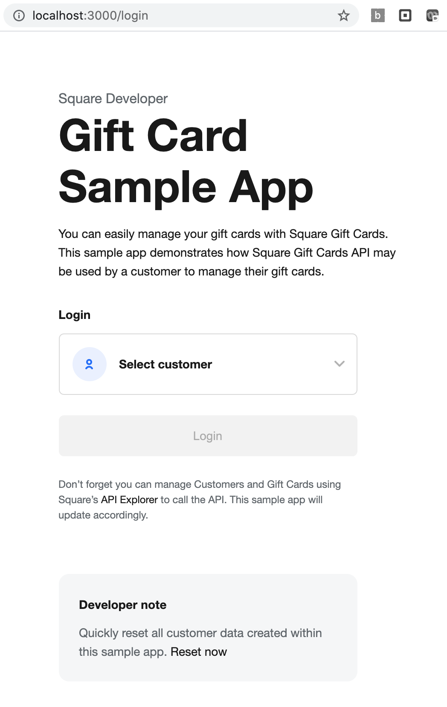

# Useful Links

- [Node.js SDK Page](https://developer.squareup.com/docs/sdks/nodejs)
- [Gift Cards API Overview](https://developer.squareup.com/docs/gift-cards/using-gift-cards-api)
- [Gift Cards API Reference](https://developer.squareup.com/reference/square/gift-cards-api)
- [Gift Card Activities API Reference](https://developer.squareup.com/reference/square/gift-card-activities-api)

# Gift Card API Sample App

- [Overview](#overview)
- [Setup](#setup)
- [Test data](#test-data)
- [Project organization](#project-organization)
- [Application flow](#application-flow)

## Overview

This sample web application is implemented using [Express](https://expressjs.com/). The purpose of this sample is to showcase the functionalities of the [Square Gift Cards API](https://developer.squareup.com/reference/square/gift-cards-api), including:

- Creating a gift card
- Activating a gift card
- Linking and unlinking a gift card to and from a customer
- Adding funds to a gift card
- Viewing gift card activities

This sample application also includes sample code for generating gift cards' payment barcodes for Square POS using 3rd party libraries such as [bwip-js](https://github.com/metafloor/bwip-js).

In addition to the Gift Cards API and the Gift Card Activities API, the application uses the following Square APIs for an integrated experience:

- The [Orders API](https://developer.squareup.com/reference/square/orders-api) to create a gift card order
- The [Payments API](https://developer.squareup.com/reference/square/payments-api) to pay for the order
- The [Customers API](https://developer.squareup.com/reference/square/customers-api) to create customer profiles in the seller's Customer Directory
- The [Locations API](https://developer.squareup.com/reference/square/locations-api) to find the seller’s currency to be used throughout the application

**_Disclaimer_**

The sample application does not implement a login authentication mechanism that is suitable for production deployment. Instead, you are allowed to log in as any customer in the seller’s account under the credentials you provide. Please consider this when using login/logout-related pieces of the source code.

## Setup

1. Ensure that you have npm installed (run `npm -v` in your terminal). If not, follow the instructions for your OS: [https://nodejs.org](https://nodejs.org)

1. Ensure you have node installed (`node -v`) with version v10 or greater.

1. Set your credentials:

   1. Create a `.env` file at the top of this directory by copying the contents of the `.env.example` file
   2. In the file, replace the placeholder texts with actual values for:
      - `ENVIRONMENT` should be set to `sandbox` or `production`
      - `SQUARE_APPLICATION_ID` and `SQUARE_ACCESS_TOKEN` can be found under the _Credentials_ tab in your Square application
      - `SQUARE_LOCATION_ID` can be found under the _Locations_ tabs in your Square application

   Navigate to the [Developer Dashboard](https://developer.squareup.com/apps) to manage and retrieve credentials for Square applications. For more information on creating a Square application, see [Getting Started](https://developer.squareup.com/docs/get-started#step-2-create-an-application).

   **Warning:** Remember to use your credentials only for testing the sample application. If you plan to make a version of this sample application available for your purposes, use the Square [OAuth API](https://developer.squareup.com/docs/oauth-api/overview) to safely manage access to Square accounts.

   **Sandbox testing:** You may configure this application to run using either Square `sandbox` or `production` environments and credentials. For testing, the `sandbox` environment is recommended because you can use fake credit or debit cards to test payments. To learn more about testing in the sandbox environment, refer to [Test in the Sandbox](https://developer.squareup.com/docs/testing/sandbox).

1. From the directory `connect-examples/v2/node_gift-cards`, install the sample application's dependencies with the following command:

   `npm install`

1. Run the application:

   `npm start`

1. Go to http://localhost:3000 in your browser to explore the application

## Test data

To explore the full features of this sample application, you are expected to have existing customers with cards on file associated with your seller's account.

If you configured your `.env` file to run in the `sandbox` environment, you will be able to create new customers and cards on file for each customer directly in the UI. To protect your `production` data, these features are disabled if you choose to run the application using the `production` environment.

You may also reset test data created by the sample app by clicking on the _Reset now_ link at the bottom of the login page.

## Project organization

This Express.js project is organized as follows:

- **.env** Square provides a `.env.example` file. You should make a copy of this file and save it as `.env`. You should provide your credentials in the `.env` file.
- **./public/** contains images, JavaScript, and CSS files used to render the pages.
- **./routes/** The following JavaScript files define the routes to handle requests:
  - **index.js** contains routes to handle all the login or logout requests
  - **dashboard.js** contains a route to display customers' gift cards
  - **gift-card.js** contains routes for managing gift cards. This includes gift card creation and managing gift card activities
  - **seed.js** contains routes for managing test data when using the `sandbox` environment
- **./util/** includes the following:
  - **square_client.js** a utility module for initializing the Square SDK client
  - **middleware.js** contains middleware functions for verifying permissions
- **./views/** contains template (.ejs) files.

## Application flow

The application flow is explained with the assumption that you are familiar with [Express](https://expressjs.com/) (the web framework for Node.js).

### Login



Many API calls used in this sample app require a customer ID. The customer ID is set when you log in as one of the customers on the login page and it is used for the following actions:

- Retrieving a list of gift cards for the customer using the [List gift cards API](https://developer.squareup.com/reference/square/gift-cards-api/list-gift-cards)
- Creating a new gift card and linking it to a customer using the [Link customer to gift card API](https://developer.squareup.com/reference/square/gift-cards-api/link-customer-to-gift-card)
- Unlinking a gift card from a customer using the [Unlink customer from gift card API](https://developer.squareup.com/reference/square/gift-cards-api/unlink-customer-from-gift-card)


If you are not logged in, you will be redirected to the _/login_ page, where the [List customers API](https://developer.squareup.com/reference/square/customers-api/list-customers) is called to retrieve a list of customers under the seller's account.

After logging in as a customer, the customer ID and login status are stored in a session, then you are redirected to the _/dashboard_. See code in [index.js](https://github.com/square/connect-api-examples/blob/master/connect-examples/v2/node_gift-cards/routes/index.js):

```
router.get("/", async (req, res, next) => {
  if (req.session.loggedIn) {
    res.redirect('/dashboard');
  } else {
    res.redirect('/login');
  }
});

router.get("/login", async (req, res, next) => {
  let customers;
  try {
    const response = await customersApi.listCustomers();
    customers = response.result.customers;
    ...

    res.render("pages/login", {customers})
  } catch(error) {
    next(error);
  }
});

/** Please do not copy the following code for authentication **/
router.post("/login", async (req, res, next) => {
  if (req.body.customer) {
    req.session.loggedIn = true;
    req.session.customerId = req.body.customer;
    ...
  }

  res.redirect("/");
});
```

**Important:** The login code in this example application does not perform any real authentication. In production, you need to write the necessary code.

#### Adding new customers

If you are running the application in `sandbox` environment, you may create test customers by clicking the _Add customer_ button from the _Select customer_ drop-down.

You can click on _Reset now_ on the login page to delete customer data created by the application.

### Gift card dashboard

Once you are logged in as a customer, you are then redirected to the _/dashboard_ page. This page displays a list of gift cards that are retrieved using the [List gift cards API](https://developer.squareup.com/reference/square/gift-cards-api/list-gift-cards). See code in [dashboard.js](https://github.com/square/connect-api-examples/blob/master/connect-examples/v2/node_gift-cards/routes/dashboard.js):

```
router.get("/", checkLoginStatus, async (req, res, next) => {
  // display a list of gift cards linked to the customer's account
  const deletion = req.query.deletion;
  try {
    let { result: { giftCards } } = await giftCardsApi.listGiftCards(
      undefined,
      undefined,
      undefined,
      undefined,
      req.session.customerId);
    if (!giftCards) {
      giftCards = [];
    }

    res.render("pages/dashboard", { giftCards, deletion });
  } catch (error) {
    next(error);
  }
});
```

The following [middleware functions](https://github.com/square/connect-api-examples/blob/master/connect-examples/v2/node_gift-cards/util/middleware.js) are executed to verify permissions:

- `checkLoginStatus` verifies that the customer is logged-in

The following screenshot shows a dashboard with no gift cards and a button to create more.


### Add a new gift card

From the _/dashboard_ page, you may add a new gift card. See code in [gift-card.js](https://github.com/square/connect-api-examples/blob/8db0b397f9c9245d7e9d78f1924f39f59f2a4de2/connect-examples/v2/node_gift-cards/routes/gift-card.js#L38):

```
router.post("/create", checkLoginStatus, async (req, res, next) => {
  try {
    // The following information will come from the request/session.
    const customerId = req.session.customerId;

    // Create an inactive gift card.
    const giftCardRequest = generateGiftCardRequest();
    const { result: { giftCard }} = await giftCardsApi.createGiftCard(giftCardRequest);

    // Now link it to the customer logged in!
    await giftCardsApi.linkCustomerToGiftCard(giftCard.id, {
      customerId
    });

    // Redirect to GET /gift-card/:gan, which will render the card-detail page.
    res.redirect("/gift-card/" + giftCard.gan);
  } catch (error) {
    console.error(error);
    next(error);
  }
});
```

The above handler makes the following Gift Cards API calls:

- `createGiftCard`: Create a gift card with no funds and pending activation using the [Create gift card API](https://developer.squareup.com/reference/square/gift-cards-api/create-gift-card)
- `linkCustomerToGiftCard`: Links the gift card to the logged-in customer using the [Link customer to gift card API](https://developer.squareup.com/reference/square/gift-cards-api/link-customer-to-gift-card)

### Card details page


Once a new gift card is created, you are redirected to the card's details page; you may also access this page through the dashboard. At this time, the card is not activated and it has no funds. See code in [gift-card.js](https://github.com/square/connect-api-examples/blob/8db0b397f9c9245d7e9d78f1924f39f59f2a4de2/connect-examples/v2/node_gift-cards/routes/gift-card.js#L63):

```
router.get("/:gan", checkLoginStatus, checkCardOwner, async (req, res, next) => {
  const giftCard = res.locals.giftCard;
  const payment = req.query.payment;

  res.render("pages/card-detail", { giftCard, payment });
});
```

### Unlink ("delete") a gift card

The Square Gift Card API does *not* support deleting a gift card. However, this application achieves a similar effect by *unlinking* the gift card from a customer, using the [Unlink gift card from customer API](https://developer.squareup.com/reference/square/gift-cards-api/unlink-customer-from-gift-card).

To "delete" a gift card in the application, go to the ellipsis menu and click the _Delete card_ button.  The underlying code unlinks the card from the customer by calling `giftCardsApi.unlinkCustomerFromGiftCard()`.

*Note:*  In the application, you can only "delete" a gift card if the card has never had any funds added to it.  However, this is an application-level constraint, and is not intrinsic to the Gift Card API itself.  The Gift Card API does let you unlink a customer from gift cards that are `ACTIVE` and have a non-zero balance.

See code in [gift-card.js](https://github.com/square/connect-api-examples/blob/8db0b397f9c9245d7e9d78f1924f39f59f2a4de2/connect-examples/v2/node_gift-cards/routes/gift-card.js#L93):

```
router.post("/:gan/delete", checkLoginStatus, checkCardOwner, checkPendingCard, async (req, res, next) => {
  try {
    const giftCard = res.locals.giftCard;
    const customerId = req.session.customerId;
    await giftCardsApi.unlinkCustomerFromGiftCard(giftCard.id, { customerId });

    // Redirect to the dashboard, with a successful deletion query parameter.
    res.redirect("/dashboard/?deletion=success");
  } catch (error) {
    next(error);
  }
});
```

### View transaction history

Once a gift card is activated, you may view the transaction history of a gift card by clicking on the ellipsis menu on a gift card's details page and then clicking the _Transaction history_ button. You are then directed to the _/gift-card/:gan/history_ page where a list of gift card activities is retrieved and displayed using the [List gift card activities API](https://developer.squareup.com/reference/square/gift-card-activities-api/list-gift-card-activities). See code in [gift-card.js](https://github.com/square/connect-api-examples/blob/8db0b397f9c9245d7e9d78f1924f39f59f2a4de2/connect-examples/v2/node_gift-cards/routes/gift-card.js#L75):

```
router.get("/:gan/history", checkLoginStatus, checkCardOwner, async (req, res, next) => {
  try {
    const giftCard = res.locals.giftCard;
    const { result: { giftCardActivities } } = await giftCardActivitiesApi.listGiftCardActivities(giftCard.id);

    res.render("pages/history", { giftCard, giftCardActivities });
  } catch (error) {
    next(error);
  }
});
```

### Add funds to a gift card

From the card's details page described above, you may add funds to the gift card using a credit or debit card on file by clicking on the _Add Funds_ button.

The customer's cards on file are retrieved using the [List cards API](https://developer.squareup.com/reference/square/cards-api/list-cards). See code in [gift-card.js](https://github.com/square/connect-api-examples/blob/8db0b397f9c9245d7e9d78f1924f39f59f2a4de2/connect-examples/v2/node_gift-cards/routes/gift-card.js#L113):

```
router.get("/:gan/add-funds", checkLoginStatus, checkCardOwner, async (req, res, next) => {
  const cardCreated = req.query.cardCreated;
  const giftCard = res.locals.giftCard;
  const customerId = req.session.customerId;

  try {
    let { result: { cards } } = await cardsApi.listCards(undefined, customerId);
    if (!cards) {
      cards = [];
    }

    res.render("pages/add-funds", { cards, giftCard, customerId, cardCreated });
  } catch (error) {
    console.error(error);
    next(error);
  }
});
```

The following [middleware functions](https://github.com/square/connect-api-examples/blob/master/connect-examples/v2/node_gift-cards/util/middleware.js) are executed to verify permissions:

- `checkLoginStatus` verifies that the customer is logged in
- `checkCardOwner` verified that the card being accessed belongs to the logged-in customer

This example application only allows customers to use credit or debit cards on file to pay for adding funds to gift cards. You cannot pay for gift cards using other gift cards.


Then you can choose the amount to add and select a card on file from the select drop-down to pay with. If there is no card on file, you may click on the _Add card_ button to create a card on file under the `sandbox` environment. Click on the _Pay_ button to submit the payment.

The following APIs are used to add funds to a gift card:

- `createOrder` creates an order with a line item that has `item_type` set to GIFT_CARD using the [Create order API](https://developer.squareup.com/reference/square/orders-api/create-order)
- `createPayment` takes payment by charging the specified card on file using the [Create payment API](https://developer.squareup.com/reference/square/payments-api/create-payment)
- `createGiftCardActivity` loads funds on the gift card using the [Create gift card activity API](https://developer.squareup.com/reference/square/gift-card-activities-api/create-gift-card-activity). In the request, the activity type is set appropriately. For example, LOAD to load funds or ACTIVATE to activate the gift card.

See code in [gift-card.js](https://github.com/square/connect-api-examples/blob/8db0b397f9c9245d7e9d78f1924f39f59f2a4de2/connect-examples/v2/node_gift-cards/routes/gift-card.js#L140):

```
router.post("/:gan/add-funds", checkLoginStatus, checkCardOwner, async (req, res, next) => {
  try {
    // The following information will come from the request/session.
    const customerId = req.session.customerId;
    const amount = req.body.amount;
    const paymentSource = req.body.cardId;
    const giftCardState = req.body.state;
    const gan = req.params.gan;

    // Get the currency to be used for the order/payment.
    const currency = req.app.locals.currency;

    // The following code runs the order/payment flow.
    // Await order call, as payment needs order information.
    const orderRequest = generateOrderRequest(customerId, amount, currency);
    const { result: { order } } = await ordersApi.createOrder(orderRequest);

    // Extract useful information from the order.
    const orderId = order.id;
    const lineItemUid = order.lineItems[0].uid;

    // We have the order response, we can move on to the payment.
    const paymentRequest = generatePaymentRequest(customerId, amount, currency, paymentSource, orderId);
    await paymentsApi.createPayment(paymentRequest);

    // Load or activate the gift card based on its current state.
    // If the gift card is pending, activate it with the amount given.
    // Otherwise, if the card is already active, load it with the amount given.
    const giftCardActivity = giftCardState === "PENDING" ? "ACTIVATE" : "LOAD";
    const giftCardActivityRequest = generateGiftCardActivityRequest(giftCardActivity, gan, orderId, lineItemUid);
    await giftCardActivitiesApi.createGiftCardActivity(giftCardActivityRequest);

    // Redirect to GET /gift-card/:gan, which will render the card-detail page, with a success message.
    res.redirect("/gift-card/" + gan + "/?payment=success");
  } catch (error) {
    next(error);
  }
});
```

The following [middleware functions](https://github.com/square/connect-api-examples/blob/master/connect-examples/v2/node_gift-cards/util/middleware.js) are executed to verify permissions:

- `checkLoginStatus` verifies that the customer is logged in
- `checkCardOwner` verified that the card being accessed belongs to the logged-in customer

**Note:** Gift cards have different maximum amount limits based on the currency of your seller account. You will not able to pay successfully if a card has reached its limit. In this app, we prevent this error from the frontend.

## Feedback
Rate this sample app [here](https://delighted.com/t/Z1xmKSqy)!