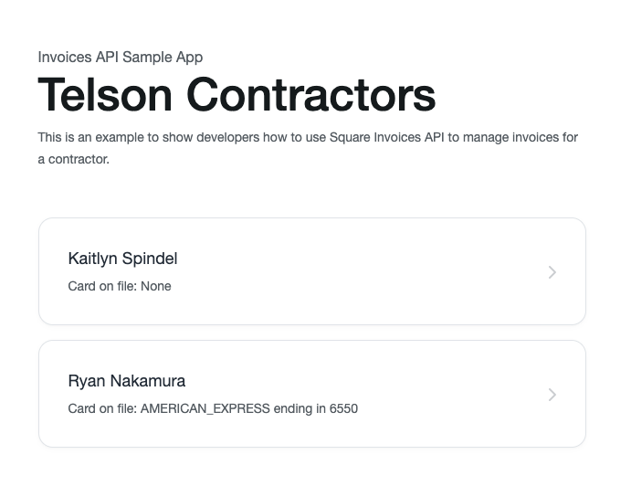
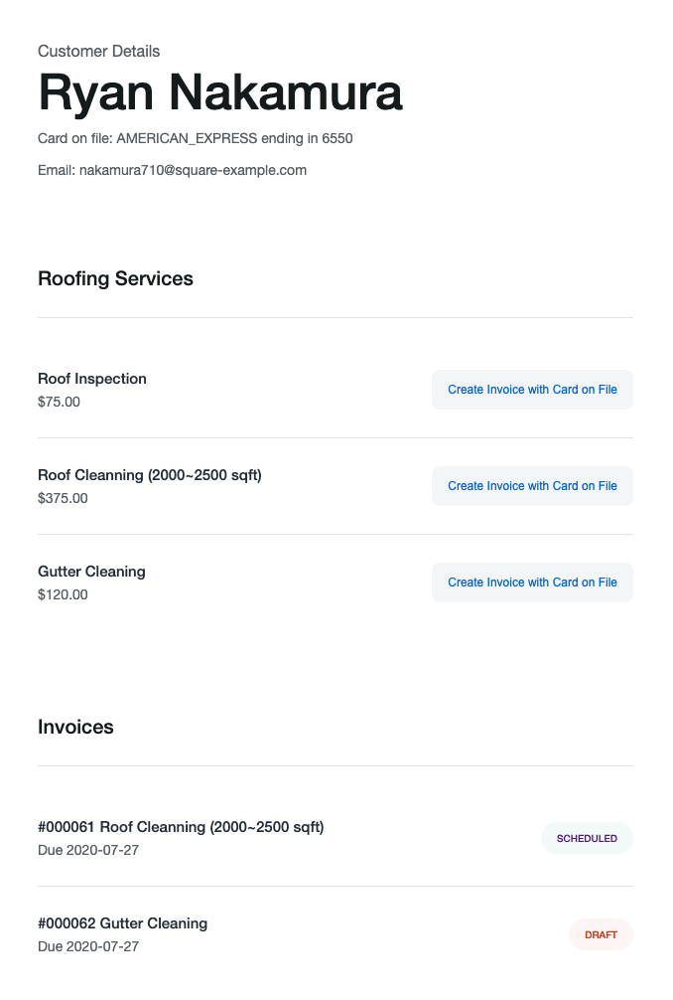
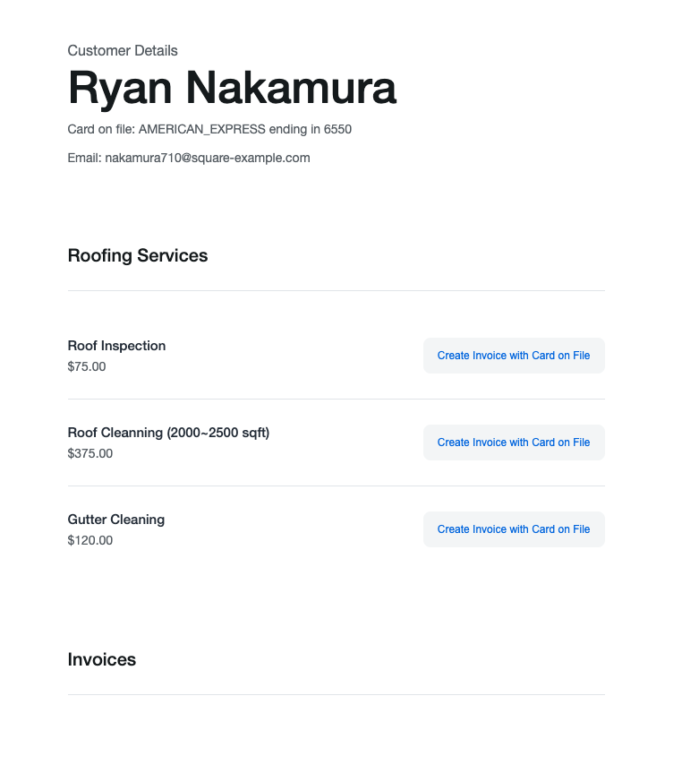

# Useful Links

* [Node.js SDK Page](https://developer.squareup.com/docs/sdks/nodejs)
* [Invoices API Overview](https://developer.squareup.com/docs/invoices-api/overview)
* [Invoices in the API Reference](https://developer.squareup.com/reference/square/invoices-api)

# Invoice API Sample App

  - [Setup](#setup)
  - [Project organization](#project-organization)
  - [Application flow](#application-flow)

This example web application explores the Square Invoices API. In the example, a contracting company maintains a list of customers. After providing a service to a customer, the company uses the application to create an invoice. In the process, the application shows some of the invoice configuration options. For example, if the customer has a card on file, the application configures the invoice to have Square charge the card on the due date and email the receipt. Otherwise, Square emails the invoice to the customer.

The customers in the application are the customer profiles from the seller’s Customer Directory. If you do not have any customer profiles created, Square provides a script that creates two customers, one with a card on file.

For a customer you choose, the application lists all previous invoices for the customer so that you can process them and test the Invoices API integrated experience.

For more information about Invoices API, see [Manage Invoices Using the Invoices API](https://developer.squareup.com/docs/invoices-api/overview).

Before you begin, note the following:

* Application framework. This sample uses [Express](https://expressjs.com/) (a web framework for Node.js). We chose Node.js primarily because it is easy to set up and test. Otherwise, you can use any other Square-provided SDKs.
* Sandbox testing. Application configuration allows you to test the application in the Square Sandbox and in the production environment. For testing, the Sandbox is ideal because you do not charge your real credit card. Instead, you use a fake card that Square provides for the Sandbox environment.

## Setup

1. Ensure you have npm installed (`npm -v` in your terminal)
   If not please follow the instructions for your OS: https://www.npmjs.com/get-npm

1. Ensure you have node installed (`node -v`) with version v14 or greater.

1. Set your credentials.

    Create a `.env` file in the root of this directory. Populate the file with the following
    line `SQUARE_ACCESS_TOKEN=your-access-token`. Replace the placeholder for `SQUARE_ACCESS_TOKEN` with your 
    own production or sandbox credentials. For more help, see our [guide on how to get 
    your credentials](https://developer.squareup.com/docs/orders-api/quick-start/step-1).

    **WARNING**: Remember to use your own credentials only for testing the sample app.
    If you plan to make a version of this sample app available for your own purposes,
    use the Square [OAuth API](https://developer.squareup.com/docs/oauth-api/overview)
    to safely manage access to Square accounts. 

1. Open your terminal and install the sample application's dependencies with the command:
    ```
    npm install
    ```

1. Test the app.

    Run the server in with your sandbox credentials:
    ```
    npm test
    ```

    Run the server with your production credentials:
    ```
    npm start
    ```


1. Open `localhost:3000` in your browser. If your account has catalog items with images, the
sample app will pull them in and display them.

    If your account does not have images (for example, if you are using a newly created account
    for testing), it will appear as a gray screen.

1. [Optional] We provide a script you can use to quickly populate your sandbox store's customers
with card on file. Run the script, wait for 30 seconds and refresh the page:

    ```
    npm run seed
    ```

## Project organization

This Express.js project is organized as follows:


*   **.env.** You provide credentials in this file.
*   **/public.** These are the CSS files used to render the home page 
*   **/routes.** The following JavaScript files define the routes to handle requests:
    * **index.js.** Provides routes to handle all the requests for the initial page, which shows a list of customers.
    * invoice.js. Provides routes to handle all the requests related to the invoice management (create, publish, cancel, delete).
    * management.js. Provides routes to render a list of contractor services that customer can purchase and also list all the invoices for the selected customer.
*   **/util.** The utility code initializes the Square SDK client.
*   **/views.** Provides the view (.pug) files.

## Application flow

The application flow is explained with the assumption that you are familiar with [Express](https://expressjs.com/) (the web framework for Node.js).

1. Initially the `router.get("/", …)` controller (in [index.js](routes/index.js#L37)) executes and renders the home page. The page shows a list of the Telson Contractors customers as shown:

   

   For each customer, the UI shows whether the customer has a card on file:
    * If you choose a customer with a card on file, the application configures the EMAIL delivery method and the CARD_ON_FILE automatic payment source for the payment request. On the due date, Square charges the customer’s card on file.
    * If you choose a customer without a card on file, the application configures the EMAIL delivery method and retains the NONE automatic payment source for the payment request. In this case, the customer follows the URL to the Square-hosted invoice page to pay the invoice.

      > NOTE: You are testing the application in the Square Sandbox. The Sandbox does not send emails, but Square hosts these invoice pages that customers can access and pay so you can test the customer experience.

    The controller makes the following Square API calls:

    * `listCustomers` (Customers API). Returns a list of customer profiles from the seller’s Customer Directory.
    * `retrieveLocation `(Locations API). Returns the seller’s main location. This will be used to determine the currency for the seller. In addition, the example uses the seller’s main location ID when creating orders.

    The controller then calls `res.render("index")` to compile the template (`/views/index.pug`) with the customer list and location ID. This index.pug file creates an HTML output and sends it to the customer (the preceding screenshot).

2. The client chooses a customer and the `router.get("/:location_id/:customer_id", …)` controller (in [management.js](routes/management.js#L28)) runs and renders the invoice management page for the customer. The following is an example screenshot. It shows a list of services the contractor offers (roof inspection, roof cleaning, and gutter cleaning). The page also shows a list of previous customer invoices.  

   

   The controller makes the following API calls to collect the information: 
    * `retrieveCustomer` (Customers API). Returns the customer information including a card ID, if present. If the card is present, the UI shows the **Create Invoice with Card on File** button as shown in the preceding screenshot. Otherwise, the UI shows the **Create Invoice** button.
    * `searchInvoices `(Invoices API). Returns a list of existing invoices associated with the main location for the customer.

    The controller then calls `res.render("management")` to compile the template (`/views/management.pug`) with the customer and invoices information. The management.pug file creates an HTML output and sends it to the customer (as shown in the preceding screenshot).

You can now create a new invoice or process an existing invoice for the customer. For illustration, we explain the application flow for creating and publishing an invoice.

### Create and publish an invoice

Regardless of whether a customer has a card on file, the creation of the invoice flow remains the same. If the customer has a card on file, the application includes the card ID in the `CreateInvoice` request. On the due date, Square charges the card on file and emails the receipt to the customer. Otherwise, Square sends the invoice to the customer’s email address.

1. After the customer chooses the **Create Invoice** button, the corresponding form action sends a POST request to the `router.post("/create", …) `controller in [invoice.js](routes/invoice.js#L66) to create an invoice.
2. The controller first makes these Square API calls:
    * `listCards` (Cards API). You need to use a card on file if the customer has one.
    * `createOrder` (Orders API). You need an order for the contractor service.
    * `createInvoice` (Invoice API). Creates an invoice by specifying the order ID and customer ID who pays for the invoice.  
 
       For illustration, the application sets the optional `scheduled_at` parameter that directs Square to process the invoice 10 minutes after creation (by default, Square processes invoices soon after they are published). In addition, the `createInvoice` call includes one payment request configured as follows:

        * `due_date` sets the payment due date to 7 days from the current date.
        * `automatic_payment_source` is set to CARD_ON_FILE depending on whether the customer has a card on file. If set to CARD_ON_FILE, the payment request includes `card_id`.

       In case of an error when creating the invoice, the application will check what type of error is returned. If the error code is `MERCHANT_SUBSCRIPTION_NOT_FOUND`, the request should be retried with a modified payload according to: https://developer.squareup.com/docs/invoices-api/overview#migration-notes.

    The controller then calls ``res.redirect(`view/${location_id}/${customer_id}/${result.invoice.id}`);`` to redirect the customer to the invoice view page, which is handled by the `router.get("/view/:location_id/:customer_id/:invoice_id",...) `controller in the same [invoice.js](routes/invoice.js#L31) file.

3. The controller does the following:
    1. First retrieves the invoice, created in the preceding step, by calling `getInvoice`.
    2. Then calls `res.render("invoice", ....)` to compile the template (`invoice.pug`) with the invoice information, create an HTML output, and send it to the customer.  

      

   In the preceding screenshot, note the following:

   * The invoice is a DRAFT invoice (you must publish it).
   * You have the option to delete the invoice (**Delete invoice**) or publish it (**Publish Invoice**). Only after you publish the invoice, Square processes the invoice (charges the card or emails the invoice with a URL to the Square-hosted invoice page for the customer to pay) .
4. Click **Publish**. The corresponding form action sends a POST request to the `router.post("/publish", …) `controller in [invoice.js](routes/invoice.js#L183) to publish the invoice.

   The controller does the following:

    1. Calls `publishInvoice` to publish the invoice. As soon as the invoice is published, the status changes from DRAFT to SCHEDULED because the `scheduled_at` field directs Square to process the invoice 10 minutes after it is created. 

    2. Calls ``res.redirect(`view/${location_id}/${customer_id}/${result.invoice.id}`);`` to redirect the request to the `router.get("/view/:location_id/:customer_id/:invoice_id",...) `controller in the same invoice.js file to retrieve and render the invoice again.

Wait until the configured `schedule_at` time (10 minutes after the invoice is created) and view the invoice. You see that the invoice status changed from SCHEDULED to UNPAID. When the `due_date` arrives (set to 7 days after the invoice is created), depending on whether the customer has a card on file, Square charges the card on the due date or the customer is responsible to pay for the invoice within the due date (wait 10 minutes and then refresh the invoice page to see the URL to the Square-hosted invoice page that you can use to pay). The invoice status then changes to PAID. 

# License

Copyright 2021 Square, Inc.
​
```
Licensed under the Apache License, Version 2.0 (the "License");
you may not use this file except in compliance with the License.
You may obtain a copy of the License at
​
   http://www.apache.org/licenses/LICENSE-2.0
​
Unless required by applicable law or agreed to in writing, software
distributed under the License is distributed on an "AS IS" BASIS,
WITHOUT WARRANTIES OR CONDITIONS OF ANY KIND, either express or implied.
See the License for the specific language governing permissions and
limitations under the License.
```

## Feedback
Rate this sample app [here](https://delighted.com/t/Z1xmKSqy)!