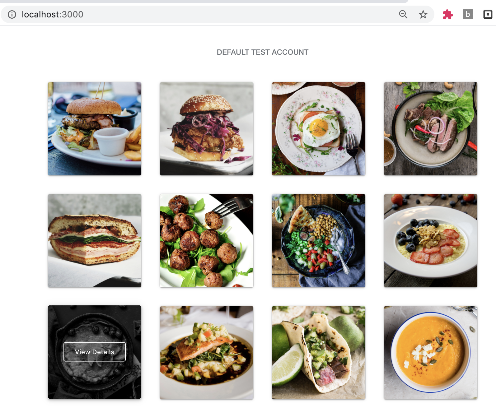
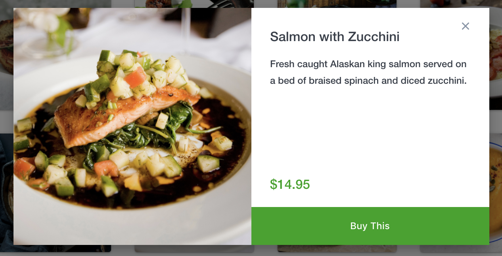
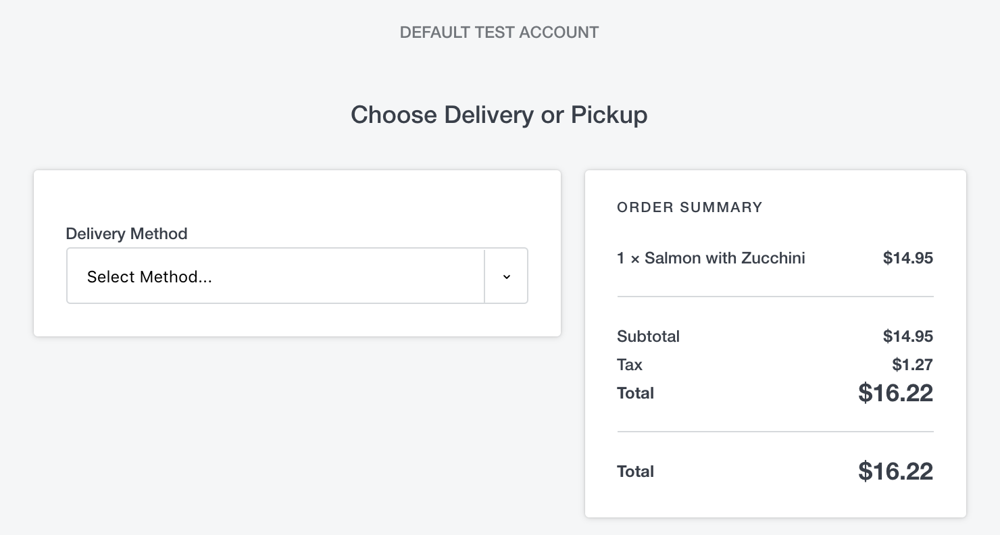
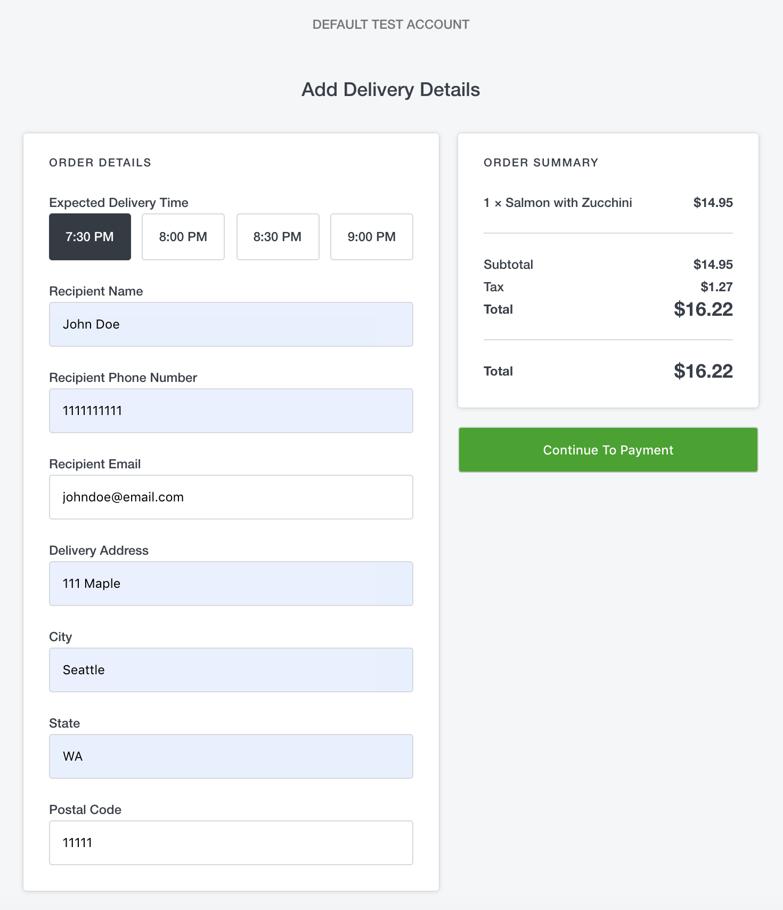
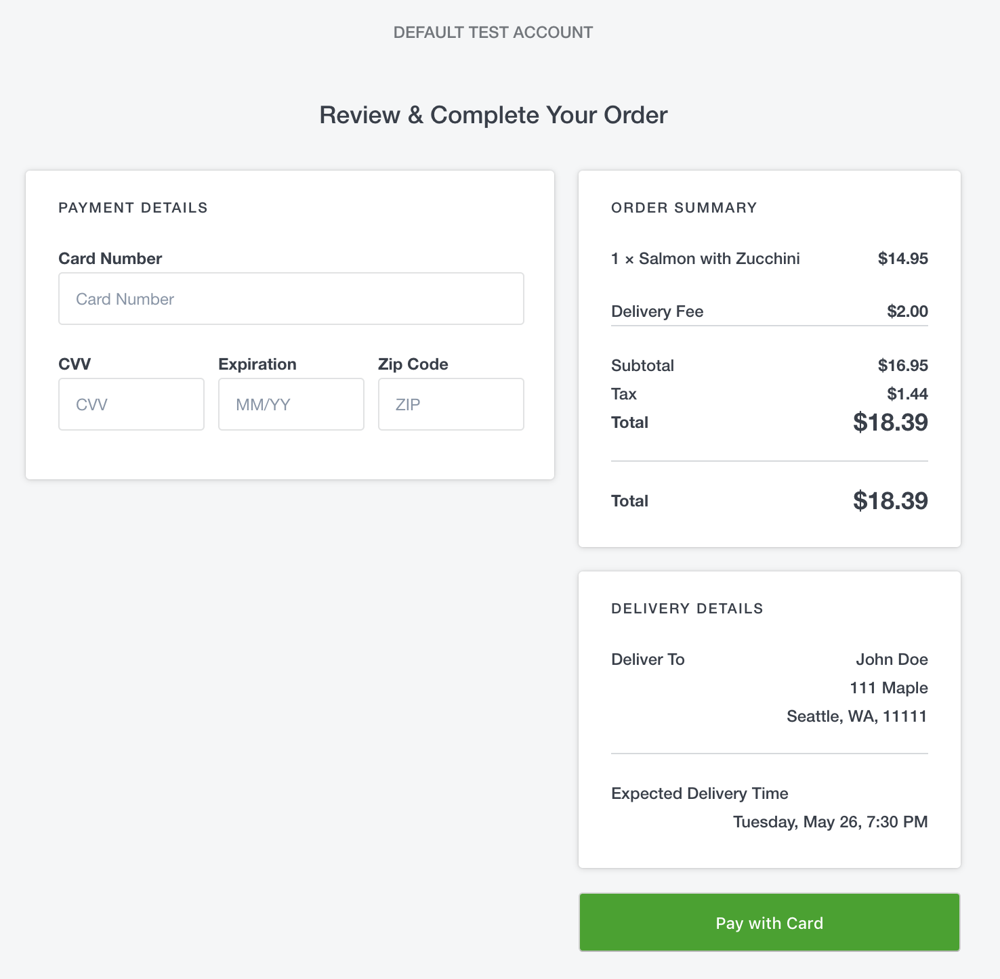
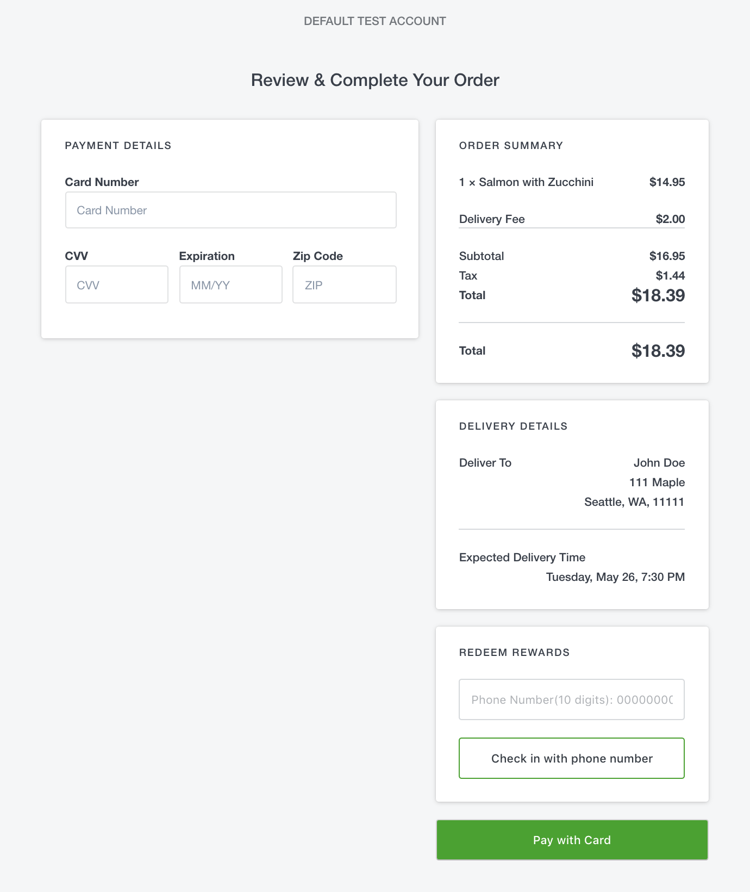
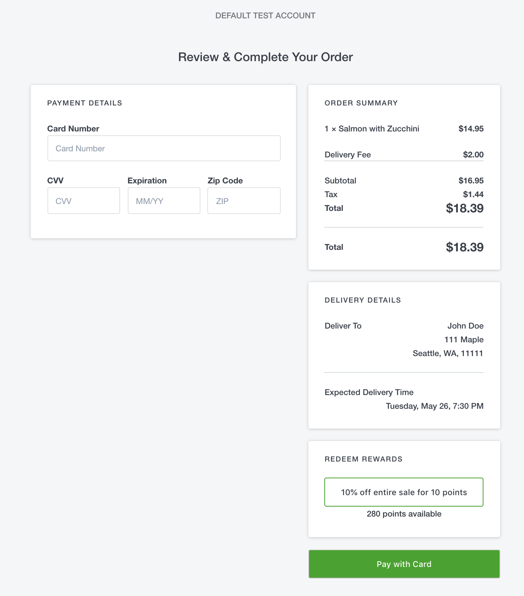
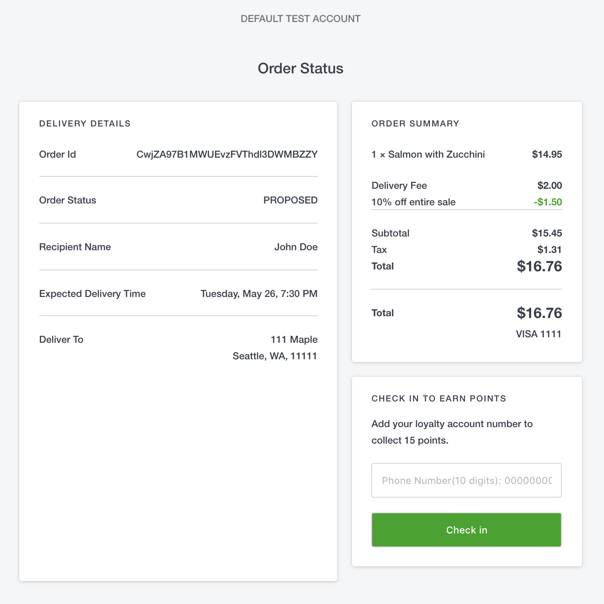
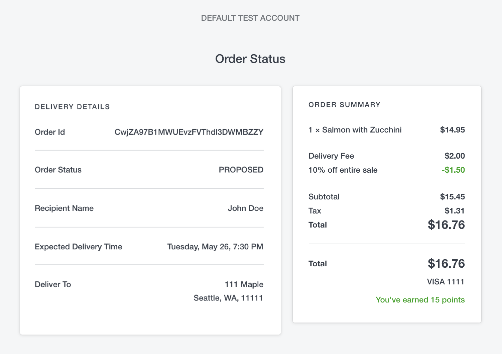

# Useful Links

* [Square Node.js SDK](https://developer.squareup.com/docs/sdks/nodejs)
* [Orders API - Order Ahead Overview](https://developer.squareup.com/docs/orders-api/order-ahead-usecase)
* [Catalog API Overview](https://developer.squareup.com/docs/catalog-api/what-it-does)
* [Payments API Overview](https://developer.squareup.com/docs/payments)
* [Loyalty API Overview](https://developer.squareup.com/docs/loyalty-api/overview)

# Order-Ahead Sample App

  - [Setup](#setup)
  - [Project organization](#project-organization)
  - [Application flow](#application-flow)

This is a sample order-ahead web application where buyers place orders online, choose delivery options,
and pay for the order. The application uses Square APIs for an integrated experience:

*   [Orders API](https://developer.squareup.com/reference/square/orders-api) to manage orders.
*   [Payments API](https://developer.squareup.com/reference/square/payments-api) to process payments.
    The application also uses the Square-provided JavaScript library to include a payment form.
*   [Catalog API](https://developer.squareup.com/reference/square/catalog-api) to manage the catalog of food items you sell.
    We provide a script for you to prepopulate catalog items, variations, categories, and taxes.
*   [Loyalty API](https://developer.squareup.com/reference/square/loyalty-api) to manage buyer loyalty accounts.

After processing the payment, the seller can fulfill the order. The seller can view the orders on the Seller Dashboard
or receive order information on the Square Point of Sale mobile app (after processing the payment, Square sends the order
details to Square Point of Sale). For more information, see [Square Point of Sale](https://squareup.com/us/en/point-of-sale). 

Before you begin, note the following:

* **Application framework.** This sample uses [Express](https://expressjs.com/) (a web framework for Node.js).
We chose Node.js primarily because it is easy to set up and test. Otherwise, you can use any other Square-provided SDKs.
* **Sandbox testing.** Application configuration allows you to test the application both in the Square Sandbox
and in the production environment. For testing, the Sandbox is great because you do not charge your real credit card.
Instead, you use a fake card that Square provides for the Sandbox environment.

## Setup

1. Set your credentials. 

    Create a copy of the `.env.example` file in the root directory of this example and name it `.env`.

    Replace the placeholders with your own production and/or sandbox credentials. 
    For more help, see our [guide on how to get your credentials](https://developer.squareup.com/docs/orders-api/quick-start/step-1).

    **WARNING**: Remember to use your own credentials only for testing the sample app.
    If you plan to make a version of this sample app available for your own purposes,
    use the Square [OAuth API](https://developer.squareup.com/docs/oauth-api/what-it-does)
    to safely manage access to Square accounts. 

1. Open your terminal and install the sample application's dependencies with the command:
    ```
    npm install
    ```

1. Test the app.

    Run the server with your production credentials:
    ```
    npm start
    ```
    Run the server in with your sandbox credentials:
    ```
    npm test
    ```

1. Open `localhost:3000` in your browser. If your account has catalog items with images, the
sample app will pull them in and display them.

    If your account does not have images (for example, if you are using a newly created account
    for testing), it will appear as a gray screen.

1. [Optional] We provide a script you can use to quickly populate your sandbox store's catalog
with test items. Run the script and refresh the page:

    ```
    npm run seed
    ```

## Project organization

This Express.js project is organized as follows:

* **/models**. JavaScript classes in these files are used to abstract data coming from Square APIs.
  The views (.pug files) use these object models to access Square data. 
* **/public.** These are the client-side JavaScript and CSS files used to render the home page and
  create and initialize the client-side payment form objects using the [Square Web Payments SDK](https://developer.squareup.com/reference/sdks/web/payments). 
* **/routes.** The following JavaScript files define the routes to handle requests:
    * **index.js.** Provides routes to handle all the requests for the initial page, which shows
      catalog items that buyers can purchase.
    * **checkout.js.** Provides routes to handle all the requests related to the checkout flow.
    * **order-confirmation.js.** Provides routes to handle order confirmation requests.
* **/util.** The code initializes the Square SDK client and provides utility functions.
  The `retrieveOrderAndLocation` function, for example, retrieves order and location information.
* **/views.** Provides the view (.pug) files.

---

## Application flow

- [Basic order-ahead flow](#basic-order-ahead-flow)
- [Integrating Loyalty Api](#integrating-loyalty-api)

---
### Basic order-ahead flow

The application flow primarily explains Square API integration with this application, with the
assumption that you are familiar with [Express](https://expressjs.com/) (the web framework for Node.js).

1. Initially the `router.get("/", …) `controller (in [index.js](routes/index.js#L39)) executes and renders the home page.
The page shows a list of food items that buyers can purchase.

    The controller makes the following Square API calls:

    * `listCatalog` (Catalog API) to retrieve a list of catalog items. 
    * `listLocations `(Locations API) to get a list of seller locations. The application uses the
      first location in the response. You need a location for the following purposes:
        1. A location ID is required to create an order. 
        2. The location object provides the business name that the application uses to display on the page header.

    The controller then calls `res.render("index")` to compile the template (`/views/index.pug`)
    with the catalog objects and location information, create an HTML output, and send it to the client.

    

1. The client chooses an item, and then chooses **Buy This**.

    

    The view file (index.pug) that compiles the page defines a form with the **Buy This** button. The form action
    sends a POST request to the `router.post("/create-order")` controller in index.js to create an order.

1. The `router.post("/create-order")` (in [index.js](routes/index.js#L70)) controller executes.
The controller does the following:

    * Calls `createOrder` (Orders API) to create an order (with one line item, price, and quantity).
      In this application, the quantity ordered is always one.

        **NOTE:** The integration of the Orders API and Catalog API enables `createOrder` to obtain
        item price, tax information from the catalog.

     * The tax is appended to the order by setting `orderRequestBody.order.taxes` to `tax_ids` of a catalog item.
     * Calls ``res.redirect(`/checkout/choose-delivery-pickup, …)`` to redirect the request to
       the `router.get("/choose-delivery-pickup", ...) `controller (in checkout.js).

1. The controller does the following:

    * Calls the `retrieveOrderAndLocation` helper function to get the order summary and
      location information. The application calls this helper function in the checkout process
      whenever a page needs to be rendered. \

    * The controller then calls `res.render("checkout/choose-delivery-pickup", ...)` to compile
      the template (`choose-delivery-pickup.pug`), create an HTML output, and send it to the client.

    


1. We assume that the buyer chooses to get the item delivered. The application renders the
**Add Delivery Details** page for the buyer to provide delivery information and the buyer then
chooses **Continue To Payment**. An example screenshot is shown:

    

    The view file `(add-delivery-details.pug`) that compiles the preceding page defines a `form`
    for the delivery details and the **Continue To Payment** button. The form action sends a POST
    request to the `router.post("/add-delivery-details", ...)` controller (in checkout.js) to update the order.

1. The `router.post("/add-delivery-details", …)` controller (in [checkout.js](routes/checkout.js#L249)) executes.
This controller does the following:

    * Calls `updateOrder` (Orders API) to update the order with `fulfillments` information and
      `service_charges` (delivery fee) to the order.
    * Calls `res.redirect(/checkout/payment)` to redirect the request to the `router.get("/payment", ...)`
      controller (in checkout.js).

1. The `router.get("/payment")` controller (in [checkout.js](routes/checkout.js#L348)) executes.
This controller does the following:

    * Calls `getLoyaltyRewardInformation `(Loyalty API) to see whether the seller offers a loyalty program.
      If yes, it also determines whether the buyer can redeem any rewards (to get discounts). We discuss loyalty integration later.
    * Calls `res.render(checkout/payment)` to compile the template (`/checkout/payment.pug`), create the HTML output,
      and send it to the client. An example screenshot is shown:

    

    The `/checkout/payment.pug` compiles the preceding page. The page includes a payment form
    (the **PAYMENT DETAILS** panel) for the buyer to provide card information. The application
    uses the Square Web Payments SDK to generate a secure payment token
    from the card information the buyer provides. After generating the token, a POST request is sent
    to the `router.post("/payment"`) controller in checkout.js.

    **NOTE:** This documentation does not cover details about using the [Web Payments SDK](https://developer.squareup.com/reference/sdks/web/payments) to embed
    a payment form in your website. For more information, see [Web Payments SDK Overview](https://developer.squareup.com/docs/web-payments/overview).

1. The `router.post("/payment"`) controller (in the [checkout.js](routes/checkout.js#L398)) executes.
This controller does the following:

     * Calls `createPayment` (Payments API) to take the payment by charging the nonce.
       Note that depending on the discount the buyer gets (part of Loyalty API integration),
       the order amount might change to $0. For example, the buyer orders a coffee and uses a
       reward to get the coffee for free. When the amount is $0, `createPayment` (Payments API)
       does not work. Instead, you call `order.payOrder `as shown so the application can go to the next step.
    * Calls the `res.redirect("/order-confirmation")` controller in order-confirmation.js.

1. The `router.get("/", ...)` controller (in [order-confirmation.js](routes/order-confirmation.js#L31)) executes.This controller calls `res.render()` to compile the template (`order-confirmation.pug`),
creates the HTML output, and sends it to the client as shown:

    

---

### Integrating Loyalty Api

- [Application flow for redeeming rewards](#application-flow-for-redeeming-rewards)
- [Application flow for accruing points](#application-flow-for-accruing-points)

To include a loyalty program in an order-ahead application, you need to set up a loyalty program
in the seller’s account. Follow [example walkthrough 1](https://developer.squareup.com/docs/loyalty-api/walkthrough1)
and set up the program. You do not need to create a loyalty account for buyers because the application creates an account, if needed.

#### Application flow for redeeming rewards

In the checkout flow, after the buyer places an order and provides fulfillment information,
the controller, `router.get("/payment", ...),` in checkout.js renders the view (`checkout/payment`).
The view compiles the following page: 



The page includes the **REDEEM REWARDS** panel only if the seller offers a loyalty program.
The Loyalty API call `listLoyaltyPrograms` in the helper function (`getLoyaltyRewardInformation`)
retrieves the seller’s loyalty program.

If the buyer provides a phone number and chooses **Check in with phone number**, the application
calls `retrieveLoyaltyAccount` to search the loyalty account associated with the phone number: 

* If a loyalty account is not found, the panel remains for the buyer to provide another phone
  number or proceed to pay for the order.
* If a loyalty account is found, the application compares the reward tiers in the program with
  the available points in the buyer’s account to determine which reward tiers the buyer can redeem.
  The controller then renders the view again. This time the **REDEEM REWARDS** panel shows list of rewards for the buyer to select:



If the buyer chooses to redeem the reward, the controller applies the discount
(call `CreateLoyaltyReward` (Loyalty API) in the `router.post("/redeem-loyalty-reward", ...)`
controller to update the order and render the page again. The **Order Summary** panel shows the discount applied:


The following source files manage the application flow related to this page: 

* **Controller.** `router.get("/payment", ...)` in [checkout.js](routes/checkout.js#L348).
* **View file.** `/checkout/payment.pug`.
* **Helper function.** `getLoyaltyRewardInformation()` in [square-client.js](util/square-client.js#L99). The helper function does several things. For example, it:
    * Calls `ListLoyaltyPrograms` (Loyalty API) to verify that the seller offers a loyalty program.
      If a loyalty program is offered, the UI can include the reward option panel. 
    * Verifies that the order is not already updated with a reward. If it is, there is no need to offer the reward tiers again.
    * Calls `RetrieveLoyaltyAccount` (Loyalty API). If a valid account ID exists, it retrieves the
      account and gets the point balance that the buyer can use to redeem a reward.
    * Compares the available points in the buyer’s account with the reward tiers that the program
      offers to determine the reward tiers the buyer qualifies for.

#### Application flow for accruing points

After the buyer provides card information and chooses **Pay with Card**, the on-click event handler
fires a `fetch` request to **checkout.js**. The subsequent code path uses the Web Payments SDK to
generate a token from the card information and calls `CreatePayment` (Payments API call) to charge the payment source. 

**NOTE:** Details about how to integrate Square payments are not covered in this exercise.
For related information, see [Square Payments in your Website](https://developer.squareup.com/docs/web-payments/overview).

After processing the payment, the request gets redirected to the `router.get("/", ...)` controller in order-confirmation.js.
The controller renders the `order-confirmation` view. The view compiles the following **Order Status** page: 



The application checks the following before deciding to include the **CHECK IN TO EARN POINTS** panel:

* Calls `listLoyaltyPrograms` (Loyalty API) to check whether the seller has an active loyalty program.
* Calls `calculateLoyaltyPoints` (Loyalty API) to determine whether the buyer should earn points for the
  purchase (the point accrual rule in the loyalty program determines how many points a buyer can earn for a purchase).
* Calls `searchLoyaltyEvents` (Loyalty API) to make sure the buyer did not previously accrue points for
  this order (when you add points to the buyer account, an event gets added to the ledger).

If the buyer chooses to provide a phone number and chooses **Check in**, the controller `router.post("/add-loyalty-point", …)`
handles the POST request to add the points to the loyalty account associated with the phone number. If no account is found,
the application creates the loyalty account by calling `createLoyaltyAccount` (Loyalty API) and adds points to the account
by calling `accumulateLoyaltyPoints` (Loyalty API). Square records each point balance change in a ledger
(see[ Loyalty Events](https://developer.squareup.com/docs/loyalty-api/overview?#loyalty-events)). The buyer is then redirect back to order-confirmation page, as shown:




The following source files manage the application flow related to this **Order Status** page:

* **Controller. `router.get("/", ...)`** in [order-confirmation.js](routes/order-confirmation.js#L31).
* **View file. `order-confirmation.pug`**.
* **Helper function.** The `getLoyaltyPointAccumulateInformation()` function in [square-client.js](util/square-client.js#L180).

    Each time the helper function is called, it makes the following Loyalty API calls to determine whether to
    include the **CHECK IN TO EARN POINTS** panel and ask the buyer for a phone number to get points for the purchase:

    * `listLoyaltyPrograms` (Loyalty API) verifies that the seller offers a loyalty program.
    * `searchLoyaltyEvents` (Loyalty API) searches the ledger for an event indicating that the buyer
      accumulated points for the order You call the `accumulateLoyaltyPoints` function to add points to the buyer’s account.
      This function also creates an event of type `ACCUMULATE_POINTS` in the ledger. For more information,
      see [Loyalty events](https://developer.squareup.com/docs/loyalty-api/overview#loyalty-events).
    * `calculateLoyaltyPoints` (Loyalty API). The example loyalty program gives the buyer one point for every dollar spent.
      The application calls this function to check the order and determine whether the buyer qualifies to accumulate at least one point.

# License

Copyright 2021 Square, Inc.
​
```
Licensed under the Apache License, Version 2.0 (the "License");
you may not use this file except in compliance with the License.
You may obtain a copy of the License at
​
   http://www.apache.org/licenses/LICENSE-2.0
​
Unless required by applicable law or agreed to in writing, software
distributed under the License is distributed on an "AS IS" BASIS,
WITHOUT WARRANTIES OR CONDITIONS OF ANY KIND, either express or implied.
See the License for the specific language governing permissions and
limitations under the License.
```

## Feedback
Rate this sample app [here](https://delighted.com/t/Z1xmKSqy)!