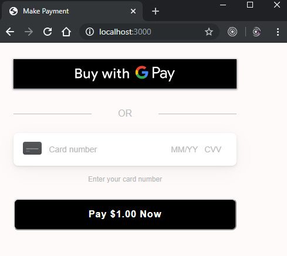

# Payment processing example: Node JS

There are two sections in this ReadMe.

* [Setup](#setup) - Provides instructions for you to download and run the app.
* [Application Flow](#application-flow) - Provides an overview of how the Square Payment form integrates in the Node.js example.

## Setup

* Create a `.env` file in the root directory of this example, `.env.example` is an example of what your `.env` file should look like. Fill in values for SQUARE_APPLICATION_ID & SQUARE_ACCESS_TOKEN & SQUARE_LOCATION_ID with your sandbox or production credentials.
<b>WARNING</b>: never save your credentials in your code.

* Ensure you have npm installed (`npm -v` in your terminal). If not please follow the instructions for your OS: https://www.npmjs.com/get-npm

* Open your terminal and type the following to install the packages:
```
npm install
```

* Then to run the server in production mode:
```
npm start
```
Or to run in sandbox mode:
```
npm test
```

* Open a browser and navigate to [localhost:3000](localhost:3000)

* [Testing using the API sandbox](https://developer.squareup.com/docs/testing/sandbox)

## Application Flow

The Node JS web application implements the Square Online payment solution to charge a payment source (debit, credit, or digital wallet payment cards).

Square Online payment solution is a 2-step process: 

1. Generate a nonce -  Using a Square Payment Form (a client-side JavaScript library 
called the **SqPaymentForm**) you accept payment source information and generate a secure payment token (nonce).

    NOTE: The SqPaymentForm library renders the card inputs and digital wallet buttons that make up the payment form and returns a secure payment token (nonce). For more information, see https://docs.connect.squareup.com/payments/sqpaymentform/what-it-does.

    After embedding the Square Payment form in your web application, it will look similar to the following screenshot:

     

2. Charge the payment source using the nonce - Using a server-side component, that uses the Connect V2 
**Payments** API, you charge the payment source using the nonce.

The following sections describe how the Node JS sample implements these steps.

### Step 1: Generate a Nonce

When the page loads it renders the form defined in the **views/index.pug** file. The page also downloads and executes the following scripts defined in the file:

 **Square Payment Form Javascript library** (https://js.squareup.com/v2/paymentform) It is a library that provides the SqPaymentForm object you use in the next script. For more information about the library, see [SqPaymentForm data model](https://developer.squareup.com/docs/api/paymentform#navsection-paymentform). 

**sq-payment-form.js** - This code provides two things:

* Initializes the **SqPaymentForm** object by initializing various 
[configuration fields](https://developer.squareup.com/docs/api/paymentform#paymentform-configurationfields) and providing implementation for [callback functions](https://developer.squareup.com/docs/api/paymentform#_callbackfunctions_detail). For example,

    * Maps the **SqPaymentForm.cardNumber** configuration field to corresponding form field:  

        ```javascript
        cardNumber: {
            elementId: 'sq-card-number',
            placeholder: '•••• •••• •••• ••••'
        }
        ```
    * **SqPaymentForm.cardNonceResponseReceived** is one of the callbacks the code provides implementation for. 

* Provides the **onGetCardNonce** event handler code that executes after you click **Pay $1.00 Now**.

After the buyer enters their information in the form and clicks **Pay $1.00 Now**, the application does the following: 

* The **onGetCardNonce** event handler executes. It first generates a nonce by calling the **SqPaymentForm.requestCardNonce** function.
* **SqPaymentForm.requestCardNonce** invokes **SqPaymentForm.cardNonceResponseReceived** callback. This callback  assigns the nonce to a form field and posts the form to the payment processing page:

    ```javascript
    document.getElementById('card-nonce').value = nonce;
    document.getElementById('nonce-form').submit();  
    ```

    This invokes the form action **process-payment**, described in next step.

### Step 2: Charge the Payment Source Using the Nonce 
All the remaining actions take place in the **routes/index.js**.  This server-side component uses the Square Node JS SDK library to call the Connect V2 **Payments** API to charge the payment source using the nonce as shown in the following code fragment. 
```javascript
...
router.post('/process-payment', async (req, res) => {
  const { nonce } = req.body;

  // length of idempotency_key should be less than 46
  const idempotencyKey = crypto.randomBytes(22).toString('hex');

  // Charge the customer's card
  const requestBody = {
    idempotencyKey,
    sourceId: nonce,
    amountMoney: {
      amount: 100, // $1.00 charge
      currency: 'USD'
    }
  };

  try {
    const { result: { payment } } = await paymentsApi.createPayment(requestBody);
    const result = JSON.stringify(payment, null, 4);

    res.render('process-payment', {
      result,
      'title': 'Payment Successful'
    });
  } catch (error) {
    let result = JSON.stringify(error, null, 4);
    if (error.errors) {
      result = JSON.stringify(error.errors, null, 4);
    }
    res.render('process-payment', {
      result,
      'title': 'Payment Failure'
    });
  }
});
...
```	

# License

Copyright 2021 Square, Inc.
​
```
Licensed under the Apache License, Version 2.0 (the "License");
you may not use this file except in compliance with the License.
You may obtain a copy of the License at
​
   http://www.apache.org/licenses/LICENSE-2.0
​
Unless required by applicable law or agreed to in writing, software
distributed under the License is distributed on an "AS IS" BASIS,
WITHOUT WARRANTIES OR CONDITIONS OF ANY KIND, either express or implied.
See the License for the specific language governing permissions and
limitations under the License.
```