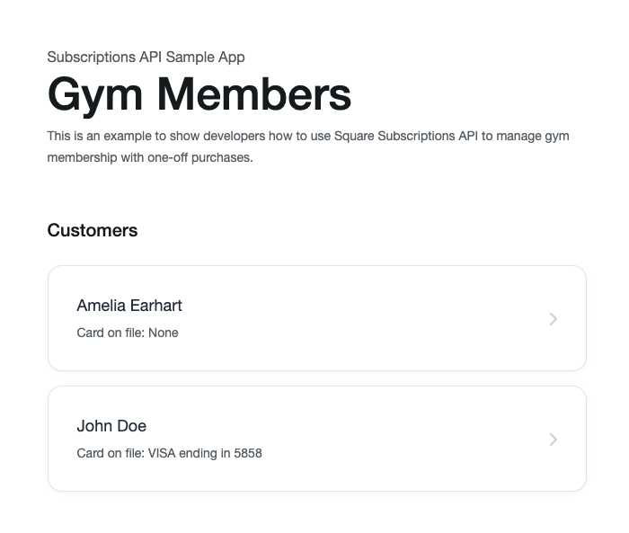
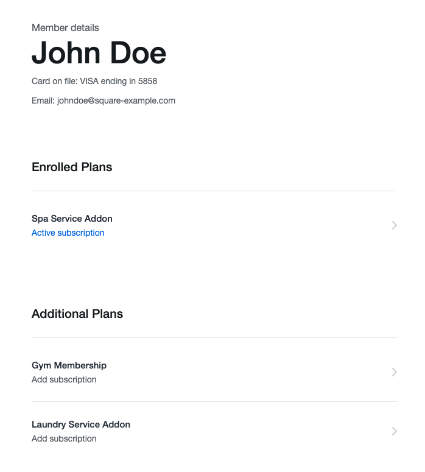
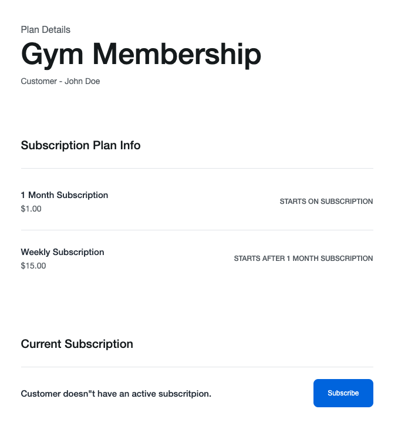
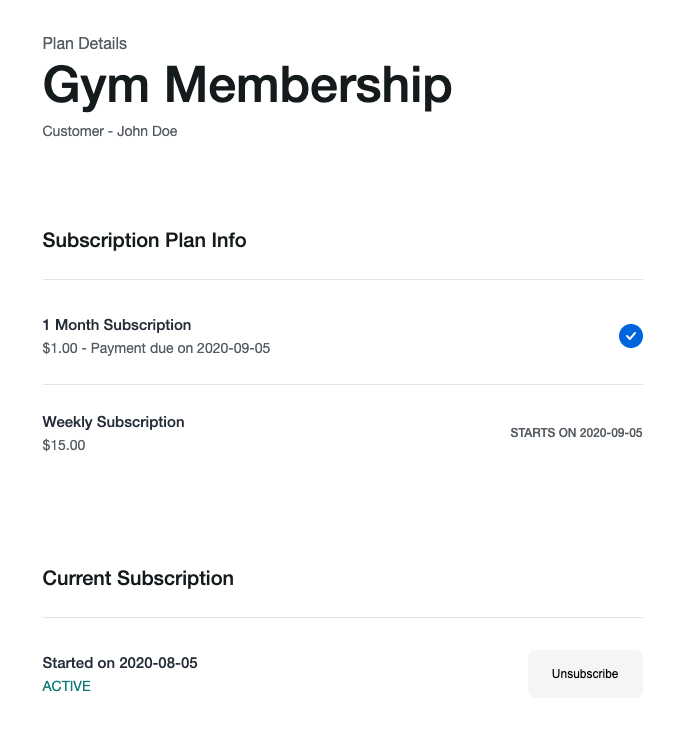
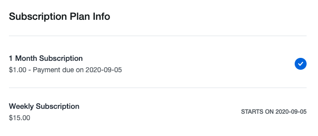

# Useful Links

- [Node.js SDK Page](https://developer.squareup.com/docs/sdks/nodejs)
- [Subscriptions API Overview](https://developer.squareup.com/docs/subscriptions/overview)
- [Catalog API Overview](https://developer.squareup.com/docs/catalog-api/what-it-does)
- [Customers API Overview](https://developer.squareup.com/docs/customers-groups-segments/what-they-are)

# Subscriptions API Sample App

- [Overview](#overview)
- [Setup](#setup)
- [Project organization](#project-organization)
- [Application flow](#application-flow)

## Overview

This sample web application is for a fictitious gym that offers subscription plans, including a gym membership, spa service, and laundry service. The application
allows the gym to create subscriptions for its customers. The application uses the following Square APIs for an integrated experience:

- The [Catalog API](https://developer.squareup.com/reference/square/catalog-api) to manage subscription plans. Subscription plans are stored as catalog objects.
- The [Subscriptions API](https://developer.squareup.com/reference/square/subscriptions-api) to manage subscriptions.
- The [Customers API](https://developer.squareup.com/reference/square/customers-api) to manage customer profiles in the seller's Customer Directory. Each gym customer has a customer profile stored in the Customer Directory.

Before you begin, note the following:

- **Application framework.** This sample uses [Express](https://expressjs.com/) (a web framework for Node.js). We chose Node.js primarily because it is easy to set up and test. Otherwise, you can use any other Square-provided SDKs.
- **Sandbox testing.** Application configuration allows you to test the application both in the Square Sandbox and in the production environment. For testing, the Sandbox is great because you do not charge your real credit card. Instead, you use a fake card that Square provides for the Sandbox environment.

## Setup

1.  Ensure you have npm installed (`npm -v` in your terminal) with version v10 or greater. If not please follow the instructions for your OS: https://www.npmjs.com/get-npm

1.  Set your credentials.

    Create a `.env` file in the root of this directory. Populate the file with the following
    line `SQUARE_ACCESS_TOKEN=YOUR_ACCESS_TOKEN`. Replace the placeholder for `SQUARE_ACCESS_TOKEN` with your
    own production or sandbox credentials. For more help, see our [guide on how to get
    your credentials](https://developer.squareup.com/docs/orders-api/quick-start/step-1).

    **WARNING**: Remember to use your own credentials only for testing the sample app.
    If you plan to make a version of this sample app available for your own purposes,
    use the Square [OAuth API](https://developer.squareup.com/docs/oauth-api/overview)
    to safely manage access to Square accounts.

1.  Open your terminal and install the sample application's dependencies with the command:

    ```
    npm install
    ```

1.  Test the app.

    Run the server in with your sandbox credentials:

    ```
    npm test
    ```

    Run the server with your production credentials:

    ```
    npm start
    ```

1.  Open `localhost:3000` in your browser. If your account has catalog items with images, the sample app will pull them in and display them.

        If your account does not have images (for example, if you are using a newly created account
        for testing), it will appear as a gray screen.

1.  [Optional] We provide a script you can use to quickly populate your sandbox store's subscription plans and customers with card on file. Run the script, wait for 30 seconds and refresh the page:

    ```
    npm run seed
    ```

## Project organization

This Express.js project is organized as follows:

- **config.json.** You provide credentials in this file.
- **/public.** Provides CSS files used to render the home page.
- **/routes.** The following JavaScript files define the routes to handle requests:
  - **index.js.** Provides routes to handle all the requests for the initial page, which shows a list of customers.
  - **subscription.js.** Provides routes to handle all the requests related to subscription management (create, update, and cancel).
  - **management.js.** Provides a route to render a list of subscription plans a member is enrolled in and a list of plans to which the member can subscribe.
- **/util.** The utility code initializes the Square SDK client.
- **/views.** Provides the view (.pug) files.
- **/models.** Provides a helper function (subscription-details-info.js) that converts subscription plan `CatalogObject` data and the subscription data into user-friendly information to display on a page.

## Sample Data

The `npm run seed` script described in the Setup section provides you
with the following two customer profiles (in the Customer Directory) and three subsciption plans to create subscriptions:

- Two customers are added to the seller’s Customer Directory: Amelia Earhart and John Doe. Joe Doe has a card on file so when John subscribes to a plan, the application includes the card ID in the `CreateSubscription` request. In this case, Square can charge the card on file.

- The fictitious gym offers three subscription plans. For more information about subscription plans, see [Set Up and Manage a Subscription Plan](https://developer.squareup.com/docs/subscriptions-api/setup-plan).

The application uses the following JSON in a [UpsertCatalogObject](https://developer.squareup.com/reference/square/catalog-api/upsert-catalog-object)
(Catalog API) request body to create the subscription plans.

- **Gym Membership plan.** This is a two-phase plan. The first phase is one month at $1 and the second phase identifies the weekly cadence at $15. Because the second phase does not specify `periods`, it never ends. However, the customer always has the option to cancel the subscription.

  ```json
  {
    "type": "SUBSCRIPTION_PLAN",
    "id": "#Multiphase Gym Membership",
    "subscriptionPlanData": {
      "name": "Gym Membership",
      "phases": [
        {
          "type": "SUBSCRIPTION_PHASE",
          "id": "#Gym Membership phase1",
          "cadence": "MONTHLY",
          "periods": 1,
          "recurringPriceMoney": {
            "amount": 100,
            "currency": "USD"
          }
        },
        {
          "type": "SUBSCRIPTION_PHASE",
          "id": "#Gym Membership phase2",
          "cadence": "WEEKLY",
          "recurringPriceMoney": {
            "amount": 1500,
            "currency": "USD"
          }
        }
      ]
    }
  }
  ```

- **Spa Service plan.** The plan is a two-phase subscription. The first phase identifies a 2-week free period and the second phase identifies a monthly cadence at $80. Note that when a customer subscribes to this plan, Square bills the customer only after the free 2-week phase ends.

      ```json
      {
       "type": "SUBSCRIPTION_PLAN",
       "id": "#Spa Service Addon",
       "subscriptionPlanData": {
         "name": "Spa Service Addon",
         "phases": [
           {
             "type": "SUBSCRIPTION_PHASE",
             "id": "#Spa Service Addon phase1",
             "cadence": "WEEKLY",
             "periods": 2,
             "recurringPriceMoney": {
               "amount": 0,
               "currency": "USD"
             }
           },
           {
             "type": "SUBSCRIPTION_PHASE",
             "id": "#Spa Service Addon phase2",
             "cadence": "MONTHLY",
             "recurringPriceMoney": {
               "amount": 8000,
               "currency": "USD"
             }
           }
         ]
       }
      }
      ```

- **Laundry Service plan:** The plan offers a weekly subscription at $10.

  ```json
  {
    "type": "SUBSCRIPTION_PLAN",
    "id": "#Laundry Service Addon",
    "subscriptionPlanData": {
      "name": "Laundry Service Addon",
      "phases": [
        {
          "type": "SUBSCRIPTION_PHASE",
          "id": "#Laundry Service Addon phase",
          "cadence": "WEEKLY",
          "recurringPriceMoney": {
            "amount": 1000,
            "currency": "USD"
          }
        }
      ]
    }
  }
  ```

## Application flow

The application flow is explained with the assumption that you are familiar with [Express](https://expressjs.com/)
(the web framework for Node.js).

1.  Initially, the `router.get("/", …)` controller (in [index.js](routes/index.js#L39))
    executes and renders the home page as shown. It shows a list of fictitious gym members. For each member,
    the UI shows some of the customer profile information (name and card on file) in the seller's Customer Directory.

       

    When creating a subscription, you have the option to either email subscription invoices or charge the customer's
    card on file and email receipts. The sample application is configured as follows:

        * If you choose a customer without a card on file, the application does not include the cardId field in the `CreateSubscription` request. Square sends the invoice to the customer's email address.
        * If you choose a customer with a card on file, the application includes the optional `cardId` in the `CreateSubscription` request. Square charges the card on file and sends a receipt of the invoice to the
        customer’s email address.

        The controller makes the following Square API calls to collect the information:

        * `listCustomers` (the Customers API). Returns a list of customer profiles from the seller’s Customer Directory.
        * `retrieveLocation` (the Locations API). Returns the seller’s main location. This example application associates subscriptions it creates with the main location. The application does not use the location information to present the
        preceding UI. However, after you choose a customer, it passes the location information in the subsequent workflow.

        The controller then calls `res.render("index") `to compile the template (/views/index.pug), create an HTML output, and send it to the client (as previously shown).

2.  The client chooses a gym member and the `router.get("/:locationId/:customerId", …)` controller (in [management.js](routes/management.js#L30)) runs.
    The controller renders the member details page showing:
    _ **Enrolled plans.** Subscription plans the member is already enrolled in.
    _ **Additional plans.** Subscription plans the member can subscribe to. For example, the member might have subscribed to
    the basic gym membership and now can subscribe to laundry services and spa services.

        

        To collect this information, the controller first calls `retrieveCustomer` (the Customers API) to get the customer profile.
        The profile provides the email address and the ID of the card on file (if present) that appears in the UI. The controller
        then does the following to create the two lists of subscriptions plans:

    - Calls`listCatalog`to retrieve the subscription plans from the catalog (a list of `CatalogObject` instances of the `SUBSCRIPTION_PLAN` type). The controller then filters the list to extract only the plans that are available at the main location. The code uses these `CatalogObject` fields to filter the objects: `presentAtAllLocations`, `absentAtLocationIds` and `presentAtLocationIds` (see [management.js](routes/management.js#L50)).

      For more information about these fields, see [CatalogObject](https://developer.squareupstaging.com/reference/square/objects/CatalogObject) type.

    - Calls `SearchSubscriptions` to retrieve a list of subscriptions created at the main location for the specific member. The code then filters the list to get only the ACTIVE or PENDING subscriptions (and not the CANCELED subscriptions). This subscription list provides the associated plans to which the member has already subscribed.
    - The controller then builds the two lists (using the `for` loop): the subscription plans to which the customer has already subscribed (Enrolled Plans) and the plans to which the customer can subscribe (Additional Plans).

      The controller then calls `res.render("management")` to compile the template (`/views/management.pug`), create an HTML output, and send it to
      the client (as previously shown).

You can now manage the subscriptions for the member:

- Choose a plan from the Enrolled Plans list and manage the subscription (for example, cancel the subscription).
- Choose a plan from the Additional Plans list, review the plan, and optionally create a subscription.

For illustration, the following section describes the process flow to create and cancel a subscription.

### Choose a plan and create a subscription

1.  After the client chooses a plan from the Additional Plans list, the `router.get("/view/:locationId/:customerId/:subscriptionPlanId", …)`
    controller (in [subscription.js](routes/subscription.js#L31)) runs and renders a page with the subscription plan information as shown:

       

        The page shows the subscription plan name in the heading, followed by the customer name. The page then shows two sections:

        * **Subscription Plan Info.** This shows the details of the subscription plan phases, including price.
        * **Current Subscription**. You can choose the **Subscribe** button to optionally create a subscription.

    The controller makes the following API calls to collect the information shown on the page:

        * `retrieveCustomer` (the Customers API). The customer name in the profile appears in the UI.
        * `retrieveCatalogObject` (the Catalog API). Returns the subscription plan. After retrieving the subscription plan, the code uses the helper code
        (subscription-details-info.js) to construct a `SubscriptionDetailsInfo` object with user-friendly information (the list of phases and phase prices)
        about the subscription plan. This information appears in the UI.
        * `searchSubscriptions` (the Subscriptions API). Searches for ACTIVE or PENDING subscriptions associated with the plan. There should be none because
        you chose a subscription plan from the Additional Subscription list. Therefore, the UI shows the **Subscribe** button.

        The controller then calls res.render("subscription") to compile the template (/views/subscription.pug), create an HTML output, and send it to the
        client (as previously shown).

2.  The client chooses **Subscribe**. The corresponding form action sends a POST request to the `router.post("/subscribe", …)` controller in
    [subscription.js](routes/subscription.js#L87) to create a subscription.

        The controller does the following:

        * Calls `createSubscription` to create the subscription.

            If the customer has a card on file, the application includes the card ID in the `CreateSubscription` call. After the subscription is created,
            Square charges the card and sends invoice receipt to the customer’s email address. If the customer does not have a card on file,
            Square sends an invoice to the customer’s email address.

            NOTE: The Square Sandbox does not send emails, but you can verify the invoice in the Seller Sandbox Dashboard. For instructions,
            see [Create Subscriptions](https://developer.squareup.com/docs/subscriptions-api/walkthrough).

        * Calls `res.redirect(`view/${locationId}/${customerId}/${planId}`);` to redirect the request to the
        `router.get("/view/:locationId/:customerId/:invoiceId",...)` controller in the same [subscription.js](routes/subscription.js#L31) file.
        This controller retrieves and renders the subscription information again.

          


        The page provides the following updated information:

        * **Subscription Plan Info.** It shows a check mark for the phase in progress and the timeline for other phases.
        * **Current Subscription.** It now shows the **Unsubscribe** button for you to optionally cancel the subscription.

## About the /models/subscription-details-info.js file

When the application retrieves a subscription plan, the `CatalogObject` provides raw details about the subscription plan including phase information. The application also retrieves the current active subscription associated with the plan. The application then uses the helper class to do necessary calculations and present user-friendly information about the plans on the **Subscription Plan Info** page as shown:



The application creates an instance of this helper class in the subscription.js file:

```javascript
const subscriptionPlanInfo = new SubscriptionDetailsInfo(
  subscriptionPlan,
  activeSubscription
);
```

# License

Copyright 2020 Square, Inc.
​

```
Licensed under the Apache License, Version 2.0 (the "License");
you may not use this file except in compliance with the License.
You may obtain a copy of the License at
​
   http://www.apache.org/licenses/LICENSE-2.0
​
Unless required by applicable law or agreed to in writing, software
distributed under the License is distributed on an "AS IS" BASIS,
WITHOUT WARRANTIES OR CONDITIONS OF ANY KIND, either express or implied.
See the License for the specific language governing permissions and
limitations under the License.
```

## Feedback

Rate this sample app [here](https://delighted.com/t/Z1xmKSqy)!
