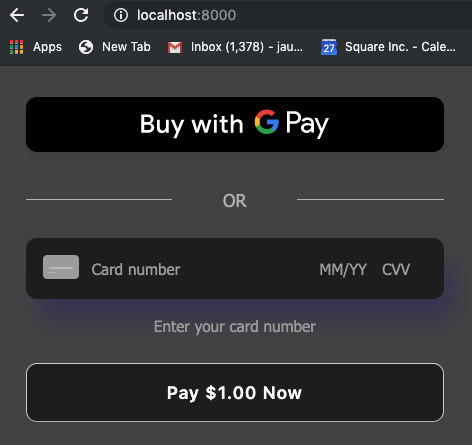

# Payment processing example: PHP

This sample demonstrates processing card payments with Square Connect API, using the
Square Connect PHP client library. There are two sections in this ReadMe.
* [Setup](#setup) - Provides instructions for you to download and run the app.
* [Application Flow](#application-flow) - Provides an overview of how the Square Payment form integrates in the PHP web application.

## Setup

### Requirements

* PHP >= 7.1

### Install the PHP client library

This sample already includes the `square/square` dependency in its `composer.json`
file. To install the client library:

1. Make sure you've downloaded Composer, following the instructions
[here](https://getcomposer.org/download/).

2. Run the following command from the directory containing `composer.json`:

```
php composer.phar install
```

### Specify your application credentials

In order for the example to work, you must edit the file called `.env` with your application credentials and environment configuration.

Open your [application dashboard](https://developer.squareup.com/). Now supply either production, sandbox, or both credentials. Open this file and update the following variables:
* WARNING: never upload .env with your credential/access_token

| Variable               |  Type    |   Description   |
|------------------------|:---------|-----------------|
| ENVIRONMENT (`*`)      | `string` | `production` or `sandbox` depending on what type of endpoint you want to hit. For testing purposes please use the sandbox mode (already configured in the `.env`)   |
| *_APP_ID               | `string` | `*` Application ID found on your Developer App Dashboard, Credentials tab.  |
| *_ACCESS_TOKEN         | `string` | `*` Access Token found at the Developer App Dashboard, Credentials tab. |
| *_LOCATION_ID           | `string` | `*` Location found at the Developer App Dashboard, Location tab. |


## Running the sample

From the sample's root directory, run:

    php -S localhost:8000

You can then visit `localhost:8000` in your browser to see the card form.

If you're using your sandbox credentials, you can test a valid credit card
payment by providing the following card information in the form:

* Card Number `4532 7597 3454 5858`
* Card CVV `111`
* Card Expiration (Any time in the future)
* Card Postal Code (Any valid US postal code)

You can find more testing values in this [article](https://docs.connect.squareup.com/articles/using-sandbox)

**Note that if you are _not_ using your sandbox credentials and you enter _real_
credit card information, YOU WILL CHARGE THE CARD.**
## Application Flow

The PHP web application implements the Square Online payment solution to charge a payment source (debit, credit, or digital wallet payment cards).

Square Online payment solution is a 2-step process: 

1. Generate a nonce -  Using a Square Payment Form (a client-side JavaScript library 
called the **SqPaymentForm**) you accept payment source information and generate a secure payment token (nonce).

    NOTE: The SqPaymentForm library renders the card inputs and digital wallet buttons that make up the payment form and returns a secure payment token (nonce). For more information, see https://docs.connect.squareup.com/payments/sqpaymentform/what-it-does.

    After embedding the Square Payment form in your web application, it will look similar to the following screenshot:

    

2. Charge the payment source using the nonce - Using a server-side component, that uses the Connect V2 
**Payments** API, you charge the payment source using the nonce.
s
The following sections describe how the PHP sample implements these steps.

### Step 1: Generate a Nonce

When the page loads it renders the form defined in the index.php file. The page also downloads and executes the following scripts defined in the file:

 **Square Payment Form Javascript library** (https://js.squareup.com/v2/paymentform)  It is a library that provides the SqPaymentForm object you use in the next script. For more information about the library, see [SqPaymentForm data model](https://docs.connect.squareup.com/api/paymentform#navsection-paymentform). 

**sq-payment-form.js** - This code provides two things:

* Initializes the **SqPaymentForm** object by initializing various 
[configuration fields](https://docs.connect.squareup.com/api/paymentform#paymentform-configurationfields) and providing implementation for [callback functions](https://docs.connect.squareup.com/api/paymentform#_callbackfunctions_detail). For example,

    * Maps the **SqPaymentForm.cardNumber** configuration field to corresponding form field:  

        ```javascript
        cardNumber: {
            elementId: 'sq-card-number',               
            placeholder: '•••• •••• •••• ••••'
        }
        ```
    * **SqPaymentForm.cardNonceResponseReceived** is one of the callbacks the code provides implementation for. 

* Provides the **onGetCardNonce** event handler code that executes after you click **Pay $1.00 Now**.

After the buyer enters their information in the form and clicks **Pay $1 Now**, the application does the following: 

* The **onGetCardNonce** event handler executes. It first generates a nonce by calling the **SqPaymentForm.requestCardNonce** function.
* **SqPaymentForm.requestCardNonce** invokes **SqPaymentForm.cardNonceResponseReceived** callback. This callback  assigns the nonce to a form field and posts the form to the payment processing page:

    ```javascript
    document.getElementById('card-nonce').value = nonce;
    document.getElementById('nonce-form').submit();  
    ```

    This invokes the form action **process-card.php**, described in next step.

### Step 2: Charge the Payment Source Using the Nonce 
All the remaining actions take place in the **process-card.php**.  This server-side component uses the Square PHP SDK library to call the Connect V2 **Payments** API to charge the payment source using the nonce as shown in the following code fragment. 
```php
...
// Set 'environment' to be either sandbox or production.
$client = new Square\SquareClient([
  'accessToken' => $access_token,  
  'environment' => $environment
]);
$nonce = $_POST['nonce'];

$payments_api = $client->getPaymentsApi();

$money = new Money();
$money->setAmount(100);
$money->setCurrency('USD');
$create_payment_request = new CreatePaymentRequest($nonce, uniqid(), $money);

try {
    $response = $payments_api->createPayment($create_payment_request);
} catch (Square\Exceptions\ApiException $e) {
}
...
```


