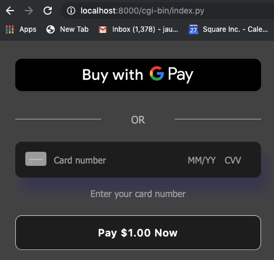

# Payment processing example: Python

This sample demonstrates processing card payments with Square Connect API, using the
Square Connect Python client library.

## Requirements

Make sure you have Python 3 >= 3.4

## Setup

### Install the Python client library

1. Make sure you have Python 3 >= 3.4 installed from [python.org](https://www.python.org/).

2. Run the following command to install `squareup` package and other dependencies:

    `pip install -r requirements.txt`

### Provide required credentials

Replace all your credentials in `config.ini`. Note that there's sandbox and
production credentials. Use `is_prod` (true/false) to choose between them.
Do not use quotes around the strings in the `config.ini` file.
(**WARNING**: never upload `config.ini` with your credentials/access_token.)

If you're just testing things out, it's recommended that you use your _sandbox_
credentials for now. See
[this article](https://docs.connect.squareup.com/articles/using-sandbox/)
for more information on the API sandbox.

## Running the sample

From the sample's root directory, run:

    python -m http.server --cgi

You can then visit `localhost:8000/cgi-bin/index.py` in your browser to see the card form.

If you're using your sandbox credentials, you can test a valid credit card
transaction by providing the following card information in the form:

* Card Number 4111 1111 1111 1111
* Card CVV 111
* Card Expiration (Any time in the future)
* Card Postal Code (Any valid US postal code)

You can find more testing values in this [article](https://docs.connect.squareup.com/articles/using-sandbox)

**Note that if you are _not_ using your sandbox credentials and you enter _real_
credit card information, YOU WILL CHARGE THE CARD.**

## Application Flow

The Python web application implements the Square Online payment solution to charge a payment source (debit, credit, or digital wallet payment cards).

Square Online payment solution is a 2-step process: 

1. Generate a nonce -  Using a Square Payment Form (a client-side JavaScript library 
called the **SqPaymentForm**) you accept payment source information and generate a secure payment token (nonce).

    NOTE: The SqPaymentForm library renders the card inputs and digital wallet buttons that make up the payment form and returns a secure payment token (nonce). For more information, see https://docs.connect.squareup.com/payments/sqpaymentform/what-it-does.

    After embedding the Square Payment form in your web application, it will look similar to the following screenshot:

     

2. Charge the payment source using the nonce - Using a server-side component, that uses the Connect V2 
**Payments** API, you charge the payment source using the nonce.
s
The following sections describe how the Python sample implements these steps.

### Step 1: Generate a Nonce

When the page loads it renders the form defined in the **cgi-bin/index.py** file. The page also downloads and executes the following scripts defined in the file:

 **Square Payment Form Javascript library** (https://js.squareup.com/v2/paymentform) It is a library that provides the SqPaymentForm object you use in the next script. For more information about the library, see [SqPaymentForm data model](https://docs.connect.squareup.com/api/paymentform#navsection-paymentform). 

**sq-payment-form.js** - This code provides two things:

* Initializes the **SqPaymentForm** object by initializing various 
[configuration fields](https://docs.connect.squareup.com/api/paymentform#paymentform-configurationfields) and providing implementation for [callback functions](https://docs.connect.squareup.com/api/paymentform#_callbackfunctions_detail). For example,

    * Maps the **SqPaymentForm.cardNumber** configuration field to corresponding form field:  

        ```javascript
        cardNumber: {
            elementId: 'sq-card-number',
            placeholder: '•••• •••• •••• ••••'
        }
        ```
    * **SqPaymentForm.cardNonceResponseReceived** is one of the callbacks the code provides implementation for. 

* Provides the **onGetCardNonce** event handler code that executes after you click **Pay $1.00 Now**.

After the buyer enters their information in the form and clicks **Pay $1.00 Now**, the application does the following: 

* The **onGetCardNonce** event handler executes. It first generates a nonce by calling the **SqPaymentForm.requestCardNonce** function.
* **SqPaymentForm.requestCardNonce** invokes **SqPaymentForm.cardNonceResponseReceived** callback. This callback  assigns the nonce to a form field and posts the form to the payment processing page:

    ```javascript
    document.getElementById('card-nonce').value = nonce;
    document.getElementById('nonce-form').submit();  
    ```

    This invokes the form action **/charges/charge_card**, described in next step.

### Step 2: Charge the Payment Source Using the Nonce 
All the remaining actions take place in the **cgi-bin/process_card.py**.  This server-side component uses the Square Python SDK library to call the Connect V2 **Payments** API to charge the payment source using the nonce as shown in the following code fragment. 
```python
...
nonce = form.getvalue('nonce')

config_type = config.get("DEFAULT", "environment").upper()
access_token = config.get(config_type, "square_access_token")

client = Client(
    access_token=access_token,
    environment=config.get("DEFAULT", "environment"),
)

idempotency_key = str(uuid.uuid1())

amount = {'amount': 100, 'currency': 'USD'}

body = {'idempotency_key': idempotency_key, 'source_id': nonce, 'amount_money': amount}

api_response = client.payments.create_payment(body)
if api_response.is_success():
  res = api_response.body['payment']
elif api_response.is_error():
  res = "Exception when calling PaymentsApi->create_payment: {}".format(api_response.errors)
...
```	