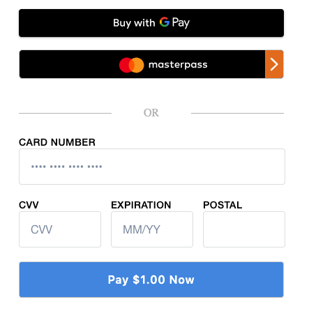

# Payment processing example: Ruby On Rails


There are two sections in this ReadMe.

* [Setup](#setup) - Provides instructions for you to download and run the app.
* [Application Flow](#application-flow) - Provides an overview of how the Square Payment form integrates in the Rails example.

## Setup

The root page has the selections for the different implementations.

Ruby version: 2.5.1

Rails version: 5.2.0

To get the app running:

* Run bundler

```
bundle install
```

* Update the .env file at the root with following values:
(<b>WARNING</b>: never upload .env with your credentials/access_token)

```
SQUARE_APPLICATION_ID=your-app-id
SQUARE_ACCESS_TOKEN=your-access-token
SQUARE_LOCATION_ID=your-location-id
```

* Run the application: `bin/rails s`

* The application runs in `http://localhost:3000/`

* [Testing using the API sandbox](https://docs.connect.squareup.com/articles/using-sandbox)

## Application Flow

The rails web application implements the Square Online payment solution to charge a payment source (debit, credit, or digital wallet payment cards).

Square Online payment solution is a 2-step process: 

1. Generate a nonce -  Using a Square Payment Form (a client-side JavaScript library 
called the **SqPaymentForm**) you accept payment source information and generate a secure payment token (nonce).

    NOTE: The SqPaymentForm library renders the card inputs and digital wallet buttons that make up the payment form and returns a secure payment token (nonce). For more information, see https://docs.connect.squareup.com/payments/sqpaymentform/what-it-does.

    After embedding the Square Payment form in your web application, it will look similar to the following screenshot:

    

2. Charge the payment source using the nonce - Using a server-side component, that uses the Connect V2 
**Payments** API, you charge the payment source using the nonce.
s
The following sections describe how the Ruby sample implements these steps.

### Step 1: Generate a Nonce

When the page loads it renders the form defined in the **/welcome/index.html.erb** file. The page also downloads and executes the following scripts defined in the file:

 **Square Payment Form Javascript library** (https://js.squareup.com/v2/paymentform) It is a library that provides the SqPaymentForm object you use in the next script. For more information about the library, see [SqPaymentForm data model](https://docs.connect.squareup.com/api/paymentform#navsection-paymentform). 

**sq-payment-form.js** - This code provides two things:

* Initializes the **SqPaymentForm** object by initializing various 
[configuration fields](https://docs.connect.squareup.com/api/paymentform#paymentform-configurationfields) and providing implementation for [callback functions](https://docs.connect.squareup.com/api/paymentform#_callbackfunctions_detail). For example,

    * Maps the **SqPaymentForm.cardNumber** configuration field to corresponding form field:  

        ```javascript
        cardNumber: {
            elementId: 'sq-card-number',               
            placeholder: '•••• •••• •••• ••••'
        }
        ```
    * **SqPaymentForm.cardNonceResponseReceived** is one of the callbacks the code provides implementation for. 

* Provides the **onGetCardNonce** event handler code that executes after you click **Pay $1.00 Now**.

After the buyer enters their information in the form and clicks **Pay $1.00 Now**, the application does the following: 

* The **onGetCardNonce** event handler executes. It first generates a nonce by calling the **SqPaymentForm.requestCardNonce** function.
* **SqPaymentForm.requestCardNonce** invokes **SqPaymentForm.cardNonceResponseReceived** callback. This callback  assigns the nonce to a form field and posts the form to the payment processing page:

    ```javascript
    document.getElementById('card-nonce').value = nonce;
    document.getElementById('nonce-form').submit();  
    ```

    This invokes the form action **/charges/charge_card**, described in next step.

### Step 2: Charge the Payment Source Using the Nonce 
All the remaining actions take place in the **charges_controller.rb**.  This server-side component uses the Square Ruby SDK library to call the Connect V2 **Payments** API to charge the payment source using the nonce as shown in the following code fragment. 
```ruby
  def charge_card
    api_client = Square::Client.new(
      access_token: Rails.application.secrets.square_access_token,
      environment: ENV['IS_PRODUCTION'] == 'false' ? 'sandbox' : 'production'
    )

    request_body = {
      :source_id => params[:nonce],
      :amount_money => {
        :amount => 100,
        :currency => 'USD'
      },
      :idempotency_key => SecureRandom.uuid
    }

    resp = api_client.payments.create_payment(body: request_body)
    if resp.success?
      @payment = resp.data.payment
    else
      @error = resp.errors
    end
  end
```	
